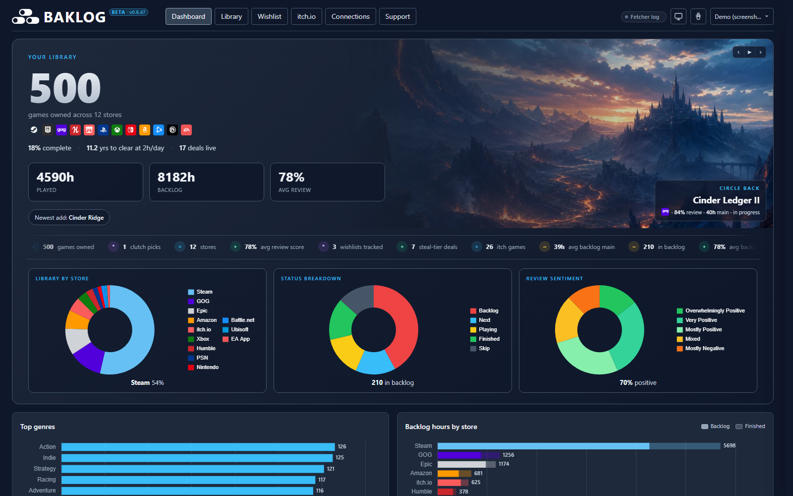
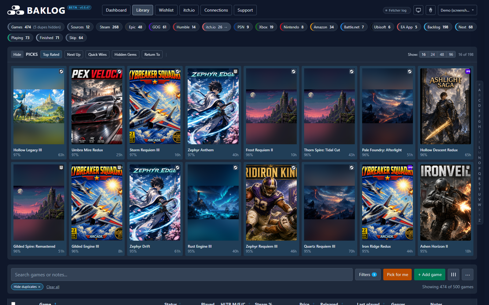
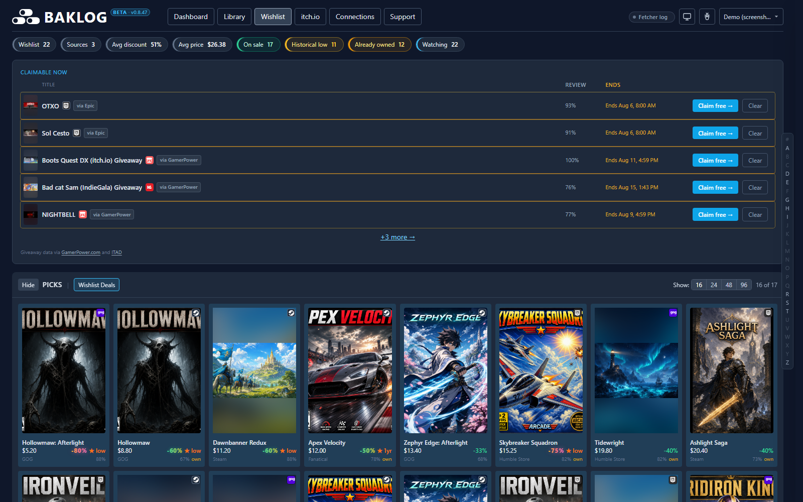
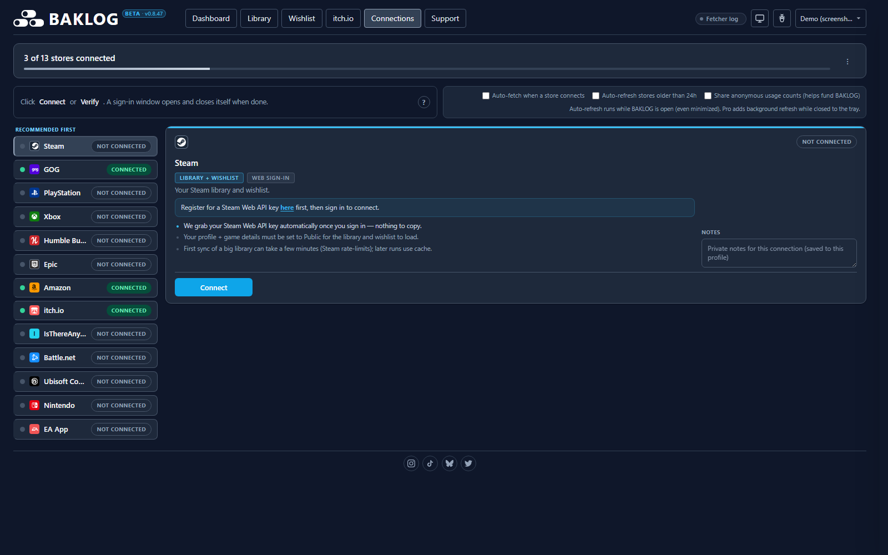

# BAKLOG&trade;

> **One honest backlog across every store.**


**BAKLOG pulls every game you own into one local, honest table.** Free forever to import · **twelve libraries and eight wishlists** · runs on your machine, no telemetry by default. Connect your stores once — Steam, GOG, PlayStation, Epic, Amazon, Xbox, Battle.net, Ubisoft Connect, Nintendo Switch, itch.io, Humble Bundle, and EA App — then decide what to play next and whether that "deal" is actually worth opening. Your credentials and library JSON stay on your machine (see [PRIVACY.md](PRIVACY.md) for the few optional network calls).

**Open source (MIT)** - [read the code on GitHub](https://github.com/Ogrods/BAKLOG) and verify the privacy story yourself. **Free forever to import · Invite-only early access.** Request access at **[baklog.app](https://baklog.app)**. Community chat: **[Discord](https://discord.gg/VFvxN5nCCB)** (canonical invite in [`shared/community.json`](shared/community.json)).

**Reviewing the repo?** See [ARCHITECTURE.md](ARCHITECTURE.md) for an honest map (local vs network, monolith shape, Pro licensing, store ToS).

**No games yet?** You don't need an existing library on any store. Start free with Epic, GOG, or Prime Gaming — see [baklog.app/#start](https://baklog.app/#start) for free entry paths and **Claimable Now** (Epic, GamerPower, IsThereAnyDeal) so you never miss a free game again.

## Watch your library appear

From empty to 2,000+ games in about 90 seconds — three steps. That timing comes from real tests on an above-average Steam library; extremely large libraries take longer.

1. **Connect** — link your stores once from the **Connections** tab. Credentials stay encrypted on your machine (OS keyring + AES-GCM fallback).
2. **Auto-fetch on connect** — BAKLOG opens a channel to each store and brings everything you own back to one table. Fetcher chips light up as each library lands, and auto-refresh quietly updates stores older than 24h while the app is open.
3. **Decide** — know what to play next, and whether that "deal" is actually worth opening.

→ Ready to install? Jump to [**Setup**](#setup). Want the full tour first? Skim the [feature list](#features).

## Documentation

End-user help lives in **[guide/](guide/README.md)** (install, connect each store, dashboard tour, troubleshooting, FAQ):

| Topic | Page |
|-------|------|
| Install and first launch | [guide/getting-started.md](guide/getting-started.md) |
| Connect each store | [guide/connecting-stores.md](guide/connecting-stores.md) |
| Tabs, filters, statuses | [guide/using-the-dashboard.md](guide/using-the-dashboard.md) |
| Auto-refresh and enrichers | [guide/refresh-and-enrichment.md](guide/refresh-and-enrichment.md) |
| Profiles and moving machines | [guide/profiles-and-moving-machines.md](guide/profiles-and-moving-machines.md) |
| Common fixes | [guide/troubleshooting.md](guide/troubleshooting.md) |
| Free vs paid, privacy | [guide/faq.md](guide/faq.md) |
| Bug reports and support | [guide/getting-help.md](guide/getting-help.md) |

## Screenshots

Every shot below is the app itself, running on a sample library. The titles and cover art are made up so these can be refreshed without publishing anyone's real collection (`scripts/capture-screenshots.ps1`).

[](assets/screenshots/dashboard.png)

[](assets/screenshots/library.png)

[](assets/screenshots/wishlist.png)

[](assets/screenshots/connections.png)

Want to click something before installing? The **[live sample at baklog.app/#demo](https://baklog.app/#demo)** runs the dashboard on dummy data, no install and no sign-in. It is a taste of the UI, not the whole app: the tabs above only fill in once you connect your own stores.

> Formerly “Steam Backlog Dashboard” — same repo, sharper name for a multi-store product.

See [PRIVACY.md](PRIVACY.md) for the data-handling story (TL;DR: library and credentials stay local; optional network calls are listed explicitly) and [SECURITY.md](SECURITY.md) for the threat model. See [ARCHITECTURE.md](ARCHITECTURE.md) for repo layout and what actually hits the network.

## Supported platforms

| OS | Status |
|----|--------|
| **Windows 10/11** | Fully supported (primary development target) |
| **macOS** | Supported with limits — **Amazon Games (launcher)** and **GOG Galaxy (local)** are Windows/macOS-only local sources |
| **Linux** | Supported with limits — **Amazon Games (launcher)** and **GOG Galaxy (local)** are unavailable; use web Connect instead |

The app itself (dashboard, `server.py`, secret storage, browser sign-in) is OS-agnostic. **Windows-only local source:** **Amazon Games (launcher)** reads the desktop launcher's DPAPI-encrypted SQLite (no portable equivalent) — on macOS/Linux use **Amazon (Prime Gaming, web)** Connect instead; the Amazon fetcher still runs and auto-picks the web session. **GOG Galaxy (local)** reads `galaxy-2.0.db` from the Galaxy install (Windows ProgramData or macOS Shared) — there is no supported Linux path, so Linux users use **GOG (web)** instead. Platform-restricted local providers show as **Unavailable** on unsupported OSes; their fetcher chips stay enabled when a web fallback exists.

Credentials are stored via your OS **keyring** (Windows Credential Manager, macOS Keychain, Linux Secret Service) with an AES-GCM file fallback — not DPAPI. See [`auth/secrets.py`](auth/secrets.py).

**Requirements (all platforms):** Python 3.11+, Google Chrome or Chromium preferred for Connect (override with `BAKLOG_CHROME_PATH`; if missing, first Connect downloads a one-time browser ~150 MB), then `pip install -r requirements.txt` and `python server.py`. Developers/CI: `pip install -e ".[dev]"` (or `requirements-dev.txt`).

### System tray (optional)

Keep BAKLOG running in the background with a tray icon — starts the same local server, opens your browser, and offers **Open**, **Restart**, and **Quit** from the menu:

```powershell
pip install pystray Pillow   # tray UI (included in requirements optional deps)
.\.venv\Scripts\pythonw.exe tray_app.py
```

Or build a portable folder (includes its own `.venv` + tray `.bat` files):

```powershell
powershell -ExecutionPolicy Bypass -File scripts/build_installer.ps1
# then run dist\baklog\Start BAKLOG (tray).bat
```

**Start at login:** the tray menu can register login autostart (Windows registry / macOS LaunchAgent / Linux XDG). In dev this launches `tray_app.py`; frozen beta builds use **BAKLOG Tray.exe** (installer or `Start BAKLOG.bat`).

**Pro background refresh:** when the server process is alive (tray or `python server.py`), the paid tier scheduler refreshes stale stores without an open browser tab. Under Supabase auth, sign in once in the browser so the server caches your plan for headless refresh.

**Optional invite-only accounts:** Supabase Auth can require sign-in before the dashboard loads; each user gets their own profile data directory. Set `BAKLOG_SUPABASE_URL` and `BAKLOG_SUPABASE_ANON_KEY` in `.env` (see `.env.example`). Without Supabase env vars, behavior is unchanged. Use `BAKLOG_AUTH_DISABLED=1` to skip the gate while testing. Set `BAKLOG_LOCAL_PROFILES=1` to keep the local Work/Play profile switcher available while Supabase sign-in stays on (optional per-profile PINs gate switching; profile mutations require the in-app `X-BAKLOG-Local` header).

### Store availability by platform

| Store | Windows | macOS / Linux |
|-------|:-------:|:-------------:|
| Steam, GOG (web), PSN, Epic, Xbox, Battle.net, Ubisoft, Nintendo, itch.io, Humble, EA, ITAD | Yes | Yes |
| Amazon (Prime Gaming, web) | Yes | Yes |
| GOG Galaxy (local `galaxy-2.0.db`) | Yes | macOS only (no Linux Galaxy path) |
| itch butler (local `butler.db`) | Yes | Yes |
| Amazon Games (launcher DB) | Yes | No |

## Stack

| Layer | Tech |
|-------|------|
| Data pipeline | Python 3 (`requests`, `python-dotenv`, `howlongtobeatpy`, `psnawp`, store-specific clients) |
| Data files | `games_<store>.json` per source (generated, gitignored) |
| Dashboard | Static HTML + ESM (`js/app.js` orchestrator) + prebuilt Tailwind (`tailwind.css`) + lazy Chart.js (`vendor/chart.umd.min.js`); optional `npm run build` → hashed `dist/` for production |
| Personal edits | `data/personal.json` via the dev server (status, notes, priority, tags, prefs, manual games); browser `localStorage` is the cache + fallback for read-only mode |
| View locally | `python server.py` → http://localhost:8765 (or `python -m http.server 8080` for read-only mode) |

## Features

- Four tabs: **Dashboard** (Chart.js analytics, default view), **Library** (deduped cross-store), **Wishlist** (deal radar), **itch.io** (quarantined indie library)
- Tabbed Picks panel: Top Rated, Next Up, Quick Wins, Hidden Gems, Return To, **Wishlist Deals**
- **Dashboard tab:** KPI cards, store/status/review donuts, genre and tag charts, HLTB histogram, releases timeline, wishlist deal stats, top-rated and quick-wins lists, itch.io recap; plus a rotating marquee of **300+ stats, insights & baseball-style sabermetrics** (completion AVG, backlog OPS, BV+, WAR); tab switches cache table renders for snappy navigation
- **itch.io tab:** hides tools/soundtracks/TTRPG PDFs by default; toggle to show all owned keys
- Status breakdown chips in the summary row (click to filter): Backlog, Next, Playing, Unfinished, Live service, Finished, Skip
- Smart sorting with optional Priority Score column
- Multi-select genre filters with AND/OR mode
- Pick-for-me randomizer and one-click JSON reload
- Inline HLTB override and compact Main/Extra/Completionist display
- Price and discount column sourced from Steam app details (or ITAD when available)
- Status-aware row styling and hidden-gem badges
- Multi-store dashboard with store filter chips and store badges
- A–Z jump nav pinned to the right edge (xl+ screens)
- **Wishlist deal radar:** filter by On Sale / Historical Low / Min Discount % / Max Price, hide already-owned cross-store
- **Connections tab:** one-click store auth (browser sign-in or API keys), encrypted credential storage, portable secrets bundle
- **Auto-fetch on connect** (default on): when you connect or reconnect a store, BAKLOG auto-fetches its library and opens the fetcher log
- **Auto-refresh stale stores** (default on): Connections toggle — quietly refreshes one store older than 24h every ~30 min while the app is open
- **Auto-enrich** (default on): after a library fetch adds games, queues HLTB, reviews, covers, and co-op tags
- **ITAD auto-refresh** (default on): deal prices refresh on a 15–60 min schedule while the dashboard is open

### Paid tier ($5/mo)

BAKLOG is free forever to import and browse. The optional **$5/mo** (**$50/yr**) paid tier is live (via Polar checkout) and adds power-user conveniences; none of today's free features move behind it:

- **Live:** no sponsored deal cards; scheduled stale-store refresh without keeping the app open; deep achievement/trophy sync (full re-pull; free tier: cached % only); bonus claimables feed (DLC, add-ons, in-game bonuses); queued bulk refresh (every stale store in one sweep from Fetcher health)
- **Coming soon:** cloud sync across machines; deal/watchlist alerts

See [baklog.app](https://baklog.app/) for the full free-vs-paid breakdown.

### Library noise vs hidden list

Two different mechanisms keep the library clean. Keep the terms distinct:

| | **Library noise** (built-in) | **Hidden list** |
|---|---|---|
| What | Entries that are not games (store apps, DLC skins, soundtracks, internal entitlement slugs like `Fortnite_StWContent`) | Real games you choose not to see |
| Who decides | Hardcoded rules in [`js/library-noise.js`](js/library-noise.js), mirrored in [`shared/library_noise.py`](shared/library_noise.py) | You |
| How it applies | Fetchers write matching rows to the catalog with a ``noise`` tag; the dashboard auto-hides them via `personal.hidden` on load (`seedNoiseAutoHidden()`). Vouchers/funds and hard-excluded Epic catalog paths are still skipped at sync. | You hide a row, or it is seeded from [`js/hidden-defaults.js`](js/hidden-defaults.js) on first run |
| Restorable | Yes - restore from the **Hidden games** panel when the row is in the catalog | Yes - restore from the **Hidden games** panel |

In short: **library noise** keeps the count honest by treating non-games as clutter; the **hidden list** is your preference for real games you own but do not want in the main view. When adding new filtering, decide which bucket it belongs in first.

## Dashboard CSS

Tailwind is precompiled into `tailwind.css` (no browser JIT in dev). Rebuild the CSS only if you change the Tailwind build pipeline in the repo.

## Frontend build (optional)

Dev mode serves raw ES modules with `Cache-Control: no-store` (no `npm` required). For a smaller, cacheable production bundle:

```bash
npm ci
npm run build          # minified CSS + bundled JS -> dist/manifest.json
$env:BAKLOG_SERVE_BUILT='1'; python server.py   # PowerShell
```

Hashed assets under `dist/` get `immutable` long-term cache; `index.html` stays `no-store`. Baseline sizes: `node scripts/measure-baseline.mjs` → `scripts/frontend-baseline.json`.

## Setup

1. Install Python **3.11+** and create a virtual environment (optional but recommended):

   ```bash
   python -m venv .venv
   .venv\Scripts\activate
   pip install -r requirements.txt
   ```

2. Get a [Steam Web API key](https://steamcommunity.com/dev/apikey) (use `localhost` as the domain).

3. Find your [SteamID64](https://steamid.io) (17-digit number starting with `7656119`).

4. (Optional, legacy) Copy `.env.example` to `.env` and fill in credentials:

   ```bash
   copy .env.example .env
   ```

   Prefer the **Connections** page instead — it stores credentials in encrypted per-profile storage. On first `python server.py` start, any `.env` credentials are imported once into the **default** profile's encrypted store and the plaintext `.env` file is deleted.

5. Set **Game details** to **Public** in Steam → Profile → Edit Profile → Privacy Settings.

### Local profiles (optional)

Use the **profile menu** in the header for separate datasets (e.g. work vs play). Full steps, PINs, and moving credentials: **[guide/profiles-and-moving-machines.md](guide/profiles-and-moving-machines.md)**.

## Fetch your libraries

**Recommended:** run `python server.py`, open **Connections**, and click **Connect** for each store. Then run fetchers from the **Fetcher health** row or the terminal.

Per-store Connect steps, CLI fallbacks, wishlist scripts, platform matrix, fetcher flags, and exit codes: **[guide/connecting-stores.md](guide/connecting-stores.md)** and **[guide/refresh-and-enrichment.md](guide/refresh-and-enrichment.md)**.

Quick start after Steam Connect:

```bash
python fetch_games.py
```

**Data attribution:** BAKLOG surfaces third-party data from [ProtonDB](https://www.protondb.com) (Steam Deck / Linux tiers, ODbL), [IsThereAnyDeal](https://isthereanydeal.com/) (deal prices), [GamerPower](https://www.gamerpower.com/) (giveaway feed), and [HowLongToBeat](https://howlongtobeat.com/) (completion hours). Store logos and trademarks belong to their respective owners; BAKLOG is not affiliated with Valve, Epic, GOG, or other storefronts.

## Open the dashboard

**Option A (recommended):** run the bundled dev server, which serves the dashboard *and* lets you trigger fetchers from the dashboard "Fetcher health" row:

```bash
python server.py
```

If you have not created a venv yet, run the [Setup](#setup) steps first (`python -m venv .venv` then `pip install -r requirements.txt`). Developers and CI can use `pip install -e ".[dev]"` instead of `requirements.txt`.

Windows shortcut: `.\scripts\start-server.ps1` (uses the project venv; run `pip install -e ".[dev]"` once if that script reports a missing venv).

Requires **Google Chrome** or **Microsoft Edge** when available (Edge ships with Windows). If neither is installed, Connections downloads a one-time Chrome for Testing build (~150 MB) on first Connect. Override the browser path with `BAKLOG_CHROME_PATH` if needed.

On Windows, always use the project venv (not the Microsoft Store `python.exe` stub). Fetcher subprocesses launched from the stub can hang `subprocess.Popen` and wedge the run queue. `server.py` auto-picks `.venv` when present.

**Connections tab:** sign in once per store from the dashboard. Credentials are encrypted in `cache/auth/` (OS keychain by default). Full install and launch steps: **[guide/getting-started.md](guide/getting-started.md)**.

**Moving credentials to a new machine:** **[guide/profiles-and-moving-machines.md](guide/profiles-and-moving-machines.md)**.

Then open http://localhost:8765 in your browser. Click any chip in the **Fetcher health** row to enqueue that fetcher.

**Option B (read-only):** `python -m http.server 8080` if you only want to browse and prefer to run fetchers in your terminal.

**Option C:** open `index.html` directly (browsers block ES modules from `file://` - use Option A or B).

### Reporting a bug, support, and personal data

Bug reports, Discord ([invite](https://discord.gg/VFvxN5nCCB)), GitHub issues, email, and how personal edits are stored: **[guide/getting-help.md](guide/getting-help.md)** and **[guide/using-the-dashboard.md](guide/using-the-dashboard.md)**.

## Auto-refresh on a schedule

While BAKLOG is open, **auto-refresh stores older than 24h** is on by default on the Connections tab. Scheduled `refresh.ps1` / `refresh.sh`, enrichers, and exit codes: **[guide/refresh-and-enrichment.md](guide/refresh-and-enrichment.md)**.

## Files

| File | Purpose |
|------|---------|
| `fetch_games.py` | Steam library → `games_steam.json` |
| `fetch_gog.py` | GOG library → `games_gog.json` |
| `fetch_psn.py` | PSN library → `games_psn.json` |
| `fetch_epic.py` | Epic library → `games_epic.json` |
| `fetch_amazon.py` | Amazon library (launcher DB or Prime Gaming web) → `games_amazon.json` |
| `fetch_xbox.py` | Xbox / Game Pass / MS Store → `games_xbox.json` |
| `fetch_battlenet.py` | Battle.net → `games_battlenet.json` |
| `fetch_ubisoft.py` | Ubisoft Connect → `games_ubisoft.json` |
| `fetch_nintendo.py` | Nintendo eShop (~2yr) → `games_nintendo.json` |
| `fetch_humble.py` | Humble Bundle library (games only) → `games_humble.json` |
| `fetch_itch.py` | itch.io owned keys → `games_itch.json` |
| `fetch_wishlist.py` | Steam wishlist → `games_wishlist.json` |
| `fetch_gog_wishlist.py` | GOG wishlist → `games_wishlist_gog.json` |
| `fetch_epic_wishlist.py` | Epic Games Store wishlist → `games_wishlist_epic.json` |
| `fetch_humble_wishlist.py` | Humble Store wishlist → `games_wishlist_humble.json` |
| `fetch_itad.py` | IsThereAnyDeal prices → `itad_prices.json` |
| `enrich_steam_reviews.py` | Backfill Steam review fields on non-Steam rows |
| `enrich_cross_store_images.py` | Backfill GOG/PSN/Epic/Amazon covers from Steam CDN |
| `enrich_hltb.py` | Backfill HLTB hours on any store JSON |
| `python -m enrichers <cmd>` | Wrapper: `hltb`, `steam-reviews`, `cross-store-images` |
| `tray_app.py` | Optional system tray launcher (starts `server.py`, opens browser) |
| `shared/`, `fetchers/` | Shared JSON slim + fetcher base helpers |
| `js/state.js`, `js/app.js` | Dashboard app (ES modules) |
| `steam_client.py` | Steam Web API + Store API client |
| `gog_client.py` | GOG embed API client |
| `psn_client.py` | PlayStation Network client (via psnawp) |
| `epic_client.py` | Epic OAuth client |
| `amazon_client.py` | Amazon Games SQLite reader (Windows launcher source) |
| `amazon_web_client.py` | Prime Gaming claims via Luna GraphQL (web source) |
| `xbox_client.py` | OpenXBL title history client |
| `battlenet_client.py` | Battle.net session (Edge cookie jar + optional .env fallback) |
| `ubisoft_client.py` | Ubisoft Connect API client |
| `nintendo_client.py` | Nintendo eShop transactions client |
| `itch_client.py` | itch.io API client |
| `itad_client.py` | IsThereAnyDeal API client |
| `hltb_client.py` | HowLongToBeat lookup |
| `index.html` | Dashboard UI (loads all store JSON files) |
| `games_*.json`, `itad_prices.json` | Generated per-store data (gitignored) |
| `cache/` | Cached API responses |

## Project layout

The repo keeps most scripts in the project root on purpose — each fetcher is a standalone entry point you run directly.

| Pattern | What it is |
|---------|------------|
| `fetch_*.py` | One script per store; writes `games_<store>.json` |
| `*_client.py` | HTTP/auth helpers used by fetchers |
| `enrich_*.py` | Backfill or maintenance scripts |
| `games_*.json`, `itad_prices.json` | Generated library data (gitignored where applicable) |
| `index.html`, `js/`, `tailwind.css` | Static dashboard (serve over HTTP for ES modules) |
| `cache/` | Cached API responses between fetch runs |
| `refresh.ps1` / `refresh.sh` | Runs the fetch sequence in order (Windows / POSIX) |

No nested `src/` folder — run fetchers from the repo root so paths stay simple.

### Dev checks

Run everything (pytest + vitest): `.\scripts\test-all.ps1` or `npm run test:all`.

**Internal docs** (marketing, licensing leads, audits) live in local gitignored folders such as `marketing/` — not in the public repo or on Vercel. Sync them to a private GitHub repo with `.\scripts\sync-internal-repo.ps1` (see script header for one-time setup).

Original per-suite commands:

```bash
pip install -e ".[dev]"
python -m pytest
ruff check shared fetchers enrichers tests
```

**Connections CDP smoke test** (requires Chrome or Edge; not run in default CI):

```bash
pytest tests/test_cdp_browser.py -m integration
```

On GitHub, use **Actions → CDP smoke (manual) → Run workflow** after a suspected Chrome/Edge regression.

Phase 0 is **local-only** — no cloud accounts or billing. Supabase/Next.js (Phase 1) stays on the roadmap until you opt in.
