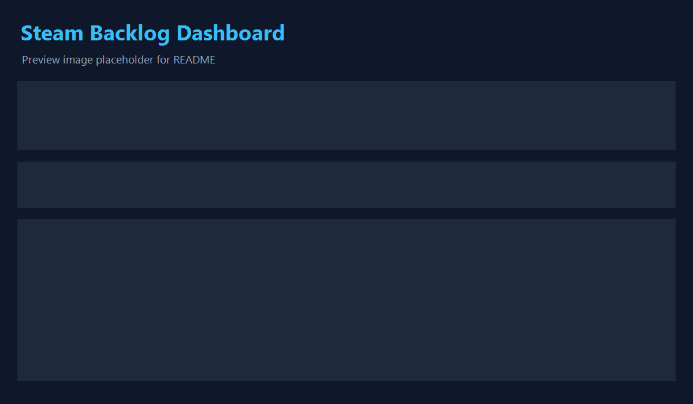

# BAKLOG

**Cross-store game backlog — local-only.**

**Beta:** source is open under [MIT](LICENSE); the product is invite-only while we test. Request access at [baklog.app](https://baklog.app).



BAKLOG helps you browse, sort, and prioritize games across **12 library sources and 8 wishlists** — Steam, GOG, PlayStation, Epic, Amazon, Xbox, Battle.net, Ubisoft Connect, Nintendo Switch, itch.io, Humble Bundle, and EA App. Nothing is hosted on the web; your credentials and library JSON stay on your machine.

**New to collecting?** You don't need an existing library on any store. Start free on Steam (free-to-play), Epic (weekly free game — claimable from the Epic Games Store Mobile app on supported devices, no PC needed), Prime Gaming (free keys), GOG (periodic giveaways), Battle.net (StarCraft), Ubisoft (Rainbow Six Siege), or itch.io (pay-what-you-want) — then let BAKLOG track your collection from day one. **Claimable Now** aggregates active giveaways from Epic, GamerPower, and IsThereAnyDeal right in your dashboard so you never miss a drop.

> Formerly “Steam Backlog Dashboard” — same repo, sharper name for a multi-store product.

See [PRIVACY.md](PRIVACY.md) for the data-handling story (TL;DR: nothing leaves your machine) and [SECURITY.md](SECURITY.md) for the threat model (TL;DR: there is no server to breach). Released under the [MIT license](LICENSE).

## Supported platforms

| OS | Status |
|----|--------|
| **Windows 10/11** | Fully supported (primary development target) |
| **macOS** | Supported with limits — **Amazon Games (launcher)** and **GOG Galaxy (local)** are Windows/macOS-only local sources |
| **Linux** | Supported with limits — **Amazon Games (launcher)** and **GOG Galaxy (local)** are unavailable; use web Connect instead |

The app itself (dashboard, `server.py`, secret storage, browser sign-in) is OS-agnostic. **Windows-only local source:** **Amazon Games (launcher)** reads the desktop launcher's DPAPI-encrypted SQLite (no portable equivalent) — on macOS/Linux use **Amazon (Prime Gaming, web)** Connect instead; the Amazon fetcher still runs and auto-picks the web session. **GOG Galaxy (local)** reads `galaxy-2.0.db` from the Galaxy install (Windows ProgramData or macOS Shared) — there is no supported Linux path, so Linux users use **GOG (web)** instead. Platform-restricted local providers show as **Unavailable** on unsupported OSes; their fetcher chips stay enabled when a web fallback exists.

Credentials are stored via your OS **keyring** (Windows Credential Manager, macOS Keychain, Linux Secret Service) with an AES-GCM file fallback — not DPAPI. See [`auth/secrets.py`](auth/secrets.py).

**Requirements (all platforms):** Python 3.11+, Google Chrome or Chromium for the Connect sign-in flow (override with `BAKLOG_CHROME_PATH`), then `pip install -r requirements.txt` and `python server.py`. Developers/CI: `pip install -e ".[dev]"` (or `requirements-dev.txt`).

### System tray (optional)

Keep BAKLOG running in the background with a tray icon — starts the same local server, opens your browser, and offers **Open**, **Restart**, and **Quit** from the menu:

```powershell
pip install pystray Pillow   # tray UI (included in requirements optional deps)
.\.venv\Scripts\pythonw.exe tray_app.py
```

Or build a portable folder (includes its own `.venv` + tray `.bat` files):

```powershell
powershell -ExecutionPolicy Bypass -File scripts/build_installer.ps1
# then run dist\baklog\Start BAKLOG (tray).bat
```

**Start at login:** the tray menu can register login autostart (Windows registry / macOS LaunchAgent / Linux XDG). In dev this launches `tray_app.py`; the PyInstaller `BAKLOG.exe` bundle is server-only (no tray icon) — use the tray launcher or `refresh.ps1` / OS scheduler for closed-app refresh.

**Pro background refresh:** when the server process is alive (tray or `python server.py`), the paid tier scheduler refreshes stale stores without an open browser tab. Under Supabase auth, sign in once in the browser so the server caches your plan for headless refresh.

**Optional invite-only accounts:** Supabase Auth can require sign-in before the dashboard loads; each user gets their own profile data directory. Set `BAKLOG_SUPABASE_URL` and `BAKLOG_SUPABASE_ANON_KEY` in `.env` (see `.env.example`). Without Supabase env vars, behavior is unchanged. Use `BAKLOG_AUTH_DISABLED=1` to skip the gate while testing. Set `BAKLOG_LOCAL_PROFILES=1` to keep the local Work/Play profile switcher available while Supabase sign-in stays on (optional per-profile PINs gate switching; profile mutations require the in-app `X-BAKLOG-Local` header).

### Store availability by platform

| Store | Windows | macOS / Linux |
|-------|:-------:|:-------------:|
| Steam, GOG (web), PSN, Epic, Xbox, Battle.net, Ubisoft, Nintendo, itch.io, Humble, EA, ITAD | Yes | Yes |
| Amazon (Prime Gaming, web) | Yes | Yes |
| GOG Galaxy (local `galaxy-2.0.db`) | Yes | macOS only (no Linux Galaxy path) |
| itch butler (local `butler.db`) | Yes | Yes |
| Amazon Games (launcher DB) | Yes | No |

## Stack

| Layer | Tech |
|-------|------|
| Data pipeline | Python 3 (`requests`, `python-dotenv`, `howlongtobeatpy`, `psnawp`, store-specific clients) |
| Data files | `games_<store>.json` per source (generated, gitignored) |
| Dashboard | Static HTML + ESM (`js/app.js` orchestrator) + prebuilt Tailwind (`tailwind.css`) + lazy Chart.js (`vendor/chart.umd.min.js`); optional `npm run build` → hashed `dist/` for production |
| Personal edits | `data/personal.json` via the dev server (status, notes, priority, tags, prefs, manual games); browser `localStorage` is the cache + fallback for read-only mode |
| View locally | `python server.py` → http://localhost:8765 (or `python -m http.server 8080` for read-only mode) |

## Features

- Four tabs: **Dashboard** (Chart.js analytics, default view), **Library** (deduped cross-store), **Wishlist** (deal radar), **itch.io** (quarantined indie library)
- Tabbed Picks panel: Top Rated, Next Up, Quick Wins, Hidden Gems, Return To, **Wishlist Deals**
- **Dashboard tab:** KPI cards, store/status/review donuts, genre and tag charts, HLTB histogram, releases timeline, wishlist deal stats, top-rated and quick-wins lists, itch.io recap; tab switches cache table renders for snappy navigation
- **itch.io tab:** hides tools/soundtracks/TTRPG PDFs by default; toggle to show all owned keys
- Status breakdown chips in the summary row (click to filter): Backlog, Next, Playing, Unfinished, Live service, Finished, Skip
- Smart sorting with optional Priority Score column
- Multi-select genre filters with AND/OR mode
- Pick-for-me randomizer and one-click JSON reload
- Inline HLTB override and compact Main/Extra/Completionist display
- Price and discount column sourced from Steam app details (or ITAD when available)
- Status-aware row styling and hidden-gem badges
- Multi-store dashboard with store filter chips and store badges
- A–Z jump nav pinned to the right edge (xl+ screens)
- **Wishlist deal radar:** filter by On Sale / Historical Low / Min Discount % / Max Price, hide already-owned cross-store
- **Connections tab:** one-click store auth (browser sign-in or API keys), encrypted credential storage, portable secrets bundle
- **Auto-fetch on connect** (default on): when you connect or reconnect a store, BAKLOG auto-fetches its library and opens the fetcher log
- **Auto-refresh stale stores** (default on): Connections toggle — quietly refreshes one store older than 24h every ~30 min while the app is open
- **Auto-enrich** (default on): after a library fetch adds games, queues HLTB, reviews, covers, and co-op tags
- **ITAD auto-refresh** (default on): deal prices refresh on a 15–60 min schedule while the dashboard is open

### Planned paid tier ($5/mo)

BAKLOG is free forever to import and browse. A planned optional paid tier adds power-user conveniences — none of today's free features will move behind it:

- **Queued bulk refresh** — queue every stale store in one sweep; fetchers run back-to-back (free tier: one store at a time, on demand)
- Scheduled stale-store refresh without keeping the app open
- Cloud sync, no sponsored deal cards, deep achievement/trophy sync (full re-pull; free tier: cached % only), deal alerts, bonus claimables feed

See [baklog.app](https://baklog.app/) for the full free-vs-paid breakdown.

### Blacklist vs hidden list

Two different mechanisms keep the library clean — keep the terms distinct:

| | **Blacklist** | **Hidden list** |
|---|---|---|
| What | Entries that aren't games (store apps, DLC skins, soundtracks, internal entitlement slugs like `Fortnite_StWContent`) | Real games a user chooses not to see |
| Who decides | Hardcoded by us | The user |
| Editable | No — never shown, can't be restored | Yes — restore any entry from the **Hidden games** panel |
| Where | `isJunkEntry()` / `JUNK_NAMES` / `JUNK_NAME_PATTERNS` in [`js/game-core.js`](js/game-core.js), mirrored by Python source filters (e.g. `_is_entitlement_slug` in `fetch_epic.py`, `psn_client.py`, `gog_filters.py`) | User hides in personal storage, seeded by the pre-hidden defaults in [`js/hidden-defaults.js`](js/hidden-defaults.js) |

In short: the **blacklist** removes noise that is never a game; the **hidden list** is a user preference for games they own but don't want cluttering the view. When adding new filtering, decide which bucket it belongs in first.

## Dashboard CSS

Tailwind is precompiled into `tailwind.css` (no browser JIT in dev). Rebuild the CSS only if you change the Tailwind build pipeline in the repo.

## Frontend build (optional)

Dev mode serves raw ES modules with `Cache-Control: no-store` (no `npm` required). For a smaller, cacheable production bundle:

```bash
npm ci
npm run build          # minified CSS + bundled JS -> dist/manifest.json
$env:BAKLOG_SERVE_BUILT='1'; python server.py   # PowerShell
```

Hashed assets under `dist/` get `immutable` long-term cache; `index.html` stays `no-store`. Baseline sizes: `node scripts/measure-baseline.mjs` → `scripts/frontend-baseline.json`.

## Setup

1. Install Python **3.11+** and create a virtual environment (optional but recommended):

   ```bash
   python -m venv .venv
   .venv\Scripts\activate
   pip install -r requirements.txt
   ```

2. Get a [Steam Web API key](https://steamcommunity.com/dev/apikey) (use `localhost` as the domain).

3. Find your [SteamID64](https://steamid.io) (17-digit number starting with `7656119`).

4. (Optional, legacy) Copy `.env.example` to `.env` and fill in credentials:

   ```bash
   copy .env.example .env
   ```

   Prefer the **Connections** page instead — it stores credentials in encrypted per-profile storage. On first `python server.py` start, any `.env` credentials are imported once into the **default** profile's encrypted store and the file is archived as `.env.imported`.

5. Set **Game details** to **Public** in Steam → Profile → Edit Profile → Privacy Settings.

### Local profiles (optional)

Use the **profile menu** in the header (next to the logo) for separate datasets — e.g. work vs play. Until you add a second profile, everything stays in the repo root as today. The first **Create** copies your current `games_*.json`, `data/`, and `cache/auth/` into `profiles/default/` (root files remain as backup) and starts the new profile empty. Switching profiles reloads the app. CLI fetchers respect `BAKLOG_PROFILE=<id>` or the active entry in `profiles/index.json` (e.g. `$env:BAKLOG_PROFILE='work'; python fetch_games.py`). The dev server **auto-ignores** `BAKLOG_PROFILE` in its own shell at startup so the menu always owns the active profile; per-run fetchers from the UI still pin the correct profile. If you had the var exported for CLI work, you can optionally clear it with `Remove-Item Env:\BAKLOG_PROFILE` (PowerShell). Rollback: delete the `profiles/` folder to return to legacy single-root layout.

## Fetch your libraries

**Recommended:** run `python server.py`, open **Connections**, and click **Connect** for each store. A headed Chrome/Edge window opens for cookie/OAuth sign-in; credentials stay local in `cache/auth/`. Then run fetchers from the dashboard **Fetcher health** row or from the terminal below.

**Steam:** Connections → Steam → Connect (grabs your API key automatically), or set `STEAM_API_KEY` + `STEAM_ID` in `.env` manually. Set **Game details** to **Public** in Steam profile privacy.

```bash
python fetch_games.py
```

Writes `games_steam.json`.

**GOG** — two sources, one `games_gog.json`:

| Source | Connections card | When to use |
|--------|------------------|-------------|
| **Galaxy (local)** | GOG Galaxy (launcher) | Richest data from `galaxy-2.0.db` (Windows ProgramData or macOS Shared). Optional: `GOG_GALAXY_DB=`. No Linux path — use web below. |
| **Web** | GOG (web) | Any OS; sign in at gog.com for library + wishlist cookie. |

`fetch_gog.py` picks **auto**: Galaxy DB when present, else the saved web session. Override with `--source local|web` or `GOG_SOURCE=`.

```bash
python fetch_gog.py
```

*Fallback:* copy the `gog-al` cookie from DevTools → Application → Cookies into `GOG_AL=` in `.env`.

If the web fetch fails with **403 Forbidden**, reconnect GOG on the Connections page (refreshes the `gog-al` cookie). On Windows/macOS with GOG Galaxy installed, prefer `python fetch_gog.py --source local` so the fetcher reads `galaxy-2.0.db` instead of the embed API.

**PlayStation (PSN):** Connections → PlayStation → Connect and sign in at the PlayStation Store. Set trophy/game privacy to **Anyone** so the library and wishlist can load.

```bash
python fetch_psn.py
```

*Fallback:* open https://ca.account.sony.com/api/v1/ssocookie while logged in and paste the `npsso` token into `PSN_NPSSO=` in `.env`.

**Epic (library):** Connections → Epic (library) → Connect — we capture and exchange the authorization code automatically.

```bash
python fetch_epic.py
```

*Fallback:* run `python fetch_epic.py --auth-help` and paste the code into `EPIC_AUTH_CODE=` in `.env`.

**Epic (wishlist):** Connections → Epic (wishlist) → Connect on the storefront (separate session from library).

```bash
python fetch_epic_wishlist.py
```

**Amazon Games** — two sources, one `games_amazon.json`:

| Source | Connections card | When to use |
|--------|------------------|-------------|
| **Launcher (Windows)** | Amazon Games (launcher) | Richest data (art, last played) from local SQLite. Optional: `AMAZON_GAMES_SQL_DIR=`. |
| **Prime Gaming (web)** | Amazon (Prime Gaming, web) | Any OS; imports Amazon-fulfilled claims only (skips Epic/Steam key drops). |

`fetch_amazon.py` picks **auto**: launcher DB on Windows when present, else the saved web session. Override with `--source launcher|web` or `AMAZON_SOURCE=`.

```bash
python fetch_amazon.py
python fetch_amazon.py --source web --dump-raw   # debug: writes cache/amazon_web_raw.json
```

**Xbox (play history):** Connections → Xbox → Connect at [xbl.io](https://xbl.io/login), or paste an OpenXBL API key into the card.

```bash
python fetch_xbox.py --skip-hltb
```

**Xbox Store wishlist:** Connections → Xbox Store wishlist → Connect on xbox.com (separate from play history above).

```bash
python fetch_xbox_wishlist.py
```

**Battle.net (unofficial):** Connections → Battle.net → Connect and sign in at [account.battle.net](https://account.battle.net/). The managed browser saves your session cookie locally; the fetcher uses it automatically (`--browser env` when a stored cookie exists).

```bash
python fetch_battlenet.py --skip-hltb
```

*Fallback (if Connect fails or you prefer CLI-only):* DevTools → Network → `games-and-subs` → copy the full `Cookie:` header into `BATTLENET_COOKIE=` in `.env`, then `python fetch_battlenet.py --browser env --skip-hltb`. On Windows, Edge/Chrome v127+ app-bound encryption can block the legacy *fetch-time* browser-jar read (`--browser edge`); Connect + stored cookie avoids that. Firefox (`--browser firefox`) or the `.env` cookie path still work without admin.

**Ubisoft Connect (unofficial):** Connections → Ubisoft Connect → Connect (one sign-in for library + Ubisoft Store wishlist).

```bash
python fetch_ubisoft.py --skip-hltb
python fetch_ubisoft_wishlist.py
```

*Fallback:* DevTools → Network → `public-ubi` → copy `Authorization` and `Ubi-SessionId` into `.env`.

**Nintendo (eShop library):** Connections → Nintendo → Connect. Only ~2 years of digital eShop history; cartridge games and older purchases must be added manually.

```bash
python fetch_nintendo.py --skip-hltb
```

*Fallback:* copy the `Cookie` header from a `ec.nintendo.com/my/transactions` request into `NINTENDO_COOKIE=` in `.env`.

**Nintendo Store wishlist:** Connections → Nintendo Store wishlist → Connect on nintendo.com.

```bash
python fetch_nintendo_wishlist.py
```

**EA App:** Connections → EA App → Connect at ea.com.

```bash
python fetch_ea.py
```

**Humble Bundle:** Connections → Humble Bundle → Connect at humblebundle.com (library page). One profile unlocks library + store wishlist fetchers.

```bash
python fetch_humble.py --skip-hltb
python fetch_humble_wishlist.py
```

**itch.io** — two sources, one `games_itch.json`:

| Source | Connections card | When to use |
|--------|------------------|-------------|
| **Butler (local)** | itch butler (local) | Owned library + playtime from the itch app's `butler.db` (Windows / macOS / Linux). No API key required when the DB is present. |
| **API** | itch.io (API key) | Richer metadata (publisher, full tag lists). API key from https://itch.io/user/settings/api-keys → `ITCH_API_KEY=` in `.env` or Connections. |

`fetch_itch.py` picks **auto**: butler.db when present, else the API key. Override with `--source local|api` or `ITCH_SOURCE=`.

```bash
python fetch_itch.py --skip-hltb
python enrich_steam_reviews.py --stores itch
```

Writes all owned keys (games + tools/TTRPG PDFs). The dashboard itch.io tab hides non-games by default.

**Wishlist:**

```bash
python fetch_wishlist.py --skip-hltb
python fetch_gog_wishlist.py    # optional — needs GOG_AL; until run, WL GOG chip shows "missing"
python fetch_epic_wishlist.py
python fetch_nintendo_wishlist.py   # Connections → Nintendo Store wishlist (separate from eShop library login)
python fetch_itad.py
```

**Display currency / FX:** set `ITAD_COUNTRY` (e.g. `GB`) before `fetch_itad.py`; ITAD and wishlist rows use that region’s currency. The script caches daily exchange rates from [Frankfurter](https://www.frankfurter.app/) and writes comparable `price_amount` fields on wishlist JSON while keeping `price_native` / `currency_native` for the store’s real price. Re-run ITAD after wishlist fetches to refresh conversions (rates can be up to 7 days old before a warning).

Wishlist JSON files (`games_wishlist.json`, `games_wishlist_gog.json`, `games_wishlist_epic.json`, `games_wishlist_nintendo.json`, etc.) are optional per store. The dashboard **Fetcher health** row marks any file that has not been fetched yet as *missing*; that is normal until you run the matching script.

**Epic wishlist:** separate from launcher OAuth (`fetch_epic.py`). Connections → **Epic (wishlist)** → Connect at [store.epicgames.com/wishlist](https://store.epicgames.com/en-US/wishlist) (clear Cloudflare if shown). `fetch_epic_wishlist.py` reuses the saved browser profile headlessly — no `EPIC_STORE_COOKIE` paste.

Fetcher options (all scripts):

- `--refresh` — ignore cache, refetch everything (Shift+click on supported library/wishlist chips)
- `--retry-misses` — re-attempt enricher rows cached as no match (Shift+click on HLTB, Reviews, Covers)
- `--only-new` — only fetch games not already in the store JSON file
- `--skip-hltb` — skip HowLongToBeat lookups (faster)
- `--allow-empty` — allow writing a zero-item result (default: refuse and exit 2 so stale data is preserved)
- Store-specific: `--appid`, `--id`, etc.

**Exit codes:** `0` success · `1` runtime/config error · `2` suspicious empty result (or ITAD resolved zero titles) · `3` drift guard refused write · `4` auth failure (expired/invalid credential). Every script prints `=== name started at … ===` and a footer summary with elapsed time.

**Stall watchdog:** when a fetcher runs via `server.py`, if stdout is silent for 30s the server injects `[server] no output for Ns — still running (PID …)` into the log panel (repeats every 60s). This is informational only — the process is not killed.

First Steam run may take several minutes for a large library (Store API is rate-limited). Subsequent runs use cache and are much faster.

## Enrichment scripts

| Script | Purpose |
|--------|---------|
| `enrich_steam_reviews.py` | Backfill Steam review % on non-Steam rows via Steam store search (gog, epic, psn, amazon, xbox, battlenet, ubisoft, nintendo, itch). Use `--stores nintendo` etc. to limit; Shift+click adds `--retry-misses`. |
| `enrich_cross_store_images.py` | Backfill `header_image` / `library_image` from the Steam CDN for non-Steam rows (gog, psn, epic, amazon, xbox, battlenet, ubisoft, nintendo). |
| `enrich_hltb.py` | Backfill HLTB hours on any `games_*.json` row missing them |
| `enrich_protondb.py` | Backfill ProtonDB Linux / Steam Deck compatibility tiers on Steam-matched rows (`protondb_tier`/`confidence`/`report_count`/`score`/`trending_tier`); no API key. Shift+click adds `--retry-misses`. |
| `fetch_itad.py` | Cross-store deal prices → `itad_prices.json` (wishlist by default); refreshes `cache/fx_rates.json` and converts wishlist store prices to display currency |
| `fetch_fx.py` | Refresh FX rates only (`cache/fx_rates.json`, Frankfurter; 24h cache) |

**Data attribution:** Steam Deck / Linux compatibility data is sourced from [ProtonDB](https://www.protondb.com), whose community report data is made available under the [Open Database License (ODbL)](https://opendatacommons.org/licenses/odbl/). BAKLOG is not affiliated with or endorsed by ProtonDB.

## Open the dashboard

**Option A (recommended):** run the bundled dev server, which serves the dashboard *and* lets you trigger fetchers from the dashboard "Fetcher health" row:

```bash
py -3.13 -m venv .venv
.\.venv\Scripts\pip install -e ".[dev]"
.\.venv\Scripts\python.exe server.py
```

Windows shortcut: `.\scripts\start-server.ps1` (same venv launcher).

Requires **Google Chrome** or **Microsoft Edge** installed (Edge ships with Windows). Connections opens a headed browser window for cookie/OAuth sign-in. Override the browser path with `BAKLOG_CHROME_PATH` if needed.

On Windows, always use the project venv (not the Microsoft Store `python.exe` stub). Fetcher subprocesses launched from the stub can hang `subprocess.Popen` and wedge the run queue. `server.py` auto-picks `.venv` when present.

**Connections tab:** sign in once per store from the dashboard — API keys via form fields, cookie/OAuth stores via a headed Chrome/Edge window. Credentials are encrypted in `cache/auth/` (OS keychain by default). `.env` still works as a fallback.

#### Moving to a new machine

1. On the old machine: **Connections** → ⋮ → **Portable bundle…** → **Export bundle…**. Choose a passphrase and save the downloaded `baklog-secrets-*.bundle` somewhere safe (USB, cloud folder, etc.).
2. Install BAKLOG on the new machine (`pip install -r requirements.txt`, `python server.py`). Chrome or Edge must be installed for Connections sign-in.
3. **Connections** → ⋮ → **Portable bundle…** → **Import bundle…**, pick the file, enter the same passphrase. The page reloads with every provider restored — including browser cookie profiles.

Terminal alternative:

```bash
python -m auth export-bundle --out baklog-secrets.bundle
python -m auth import-bundle baklog-secrets.bundle
```

See [PRIVACY.md](PRIVACY.md#portable-secret-bundle) for what's inside the bundle and [SECURITY.md](SECURITY.md) for the full threat model.

Then open http://localhost:8765 in your browser. Click any chip in the **Fetcher health** row to enqueue that fetcher — output streams live into a log panel and the chip refreshes when the run finishes.

**Option B (read-only):** `python -m http.server 8080` if you only want to browse and prefer to run fetchers in your terminal.

**Option C:** open `index.html` directly (browsers block automatic local file loading without a server — use Option A or B for the full experience).

### Reporting a bug

When something goes wrong, BAKLOG captures uncaught errors and unhandled
promise rejections automatically and surfaces a sticky red toast in the
top-right corner. From the toast, kebab menu (**Report a bug…**), or
`?debug=1` overlay you can:

- **Send report** — opens a consent dialog showing the exact sanitized JSON
  payload (errors + app context: version, view, data version, filter count,
  table fingerprint, last render time, dashboard counters). Add an optional
  contact email and note, then confirm to POST the bundle to the maintainer.
  Nothing is sent until you click **Send report** in the dialog. Personal
  notes, library JSON, and credentials are never included (see
  [PRIVACY.md](PRIVACY.md#error-logs-and-bug-reporting) for the full whitelist).
- **Copy bug bundle** — same payload to your clipboard with no network request.
  Paste into a [new GitHub issue](https://github.com/Ogrods/steam-backlog/issues/new)
  if you prefer.
- **Errors only** — copies just the error array, without app context.
- **Details** — expand the stack trace inline.

The last 200 errors are kept in browser `localStorage` so the bundle can
include history across reloads. Clear the ring with
`localStorage.removeItem('baklog-error-log')` in DevTools.

**Fetcher failures are separate.** Store refresh problems show up in the
Fetcher health panel and `profiles/<id>/cache/runs/*.jsonl` logs (exit codes
0–4). They are not auto-sent to the bug-report endpoint.

**Quick test:** DevTools → `throw new Error('test')` → sticky toast appears →
**Report a bug…** shows the scrubbed bundle preview. Nothing is POSTed until
you click **Send report** in the dialog. For local dev without hitting
production, set `window.__BAKLOG_REPORT_ENDPOINT` or the
`baklog-report-endpoint` meta tag in `index.html` (see
[PRIVACY.md](PRIVACY.md#error-logs-and-bug-reporting)).

### Community & support

- **Discord** — [Join the community](https://discord.gg/baklog) for beta chat,
  `#bug-reports`, and `#feature-requests`. No app data is piped to Discord;
  use **Report a bug…** or paste a **Copy bug bundle** when filing bugs.
- **GitHub** — [Open an issue](https://github.com/Ogrods/steam-backlog/issues/new)
  for reproducible bugs and feature requests (long-term record).
- **Email** — [dan@baklog.app](mailto:dan@baklog.app) for invite or support
  questions.

Discord invite URL is canonical in
[`shared/community.json`](shared/community.json) — keep it in sync with the
landing footer and app kebab menu.

### Personal data storage

When you launch via `python server.py` (the recommended mode), your statuses, notes, priorities, tags, UI prefs, and manually-added games are persisted to `data/personal.json`. The file is the source of truth — back it up, sync it via Dropbox/OneDrive/git, copy it to another machine. The dev server writes atomically (temp file + rename) and keeps a rolling set of timestamped backups in `data/personal_backups/` so a bad save can't wipe earlier edits.

The browser's `localStorage` still exists as a hot cache that the page hydrates from on first paint, but it is overwritten from `data/personal.json` on every boot. **Server wins.**

If you instead serve the dashboard read-only via `python -m http.server`, the dashboard falls back to localStorage as in earlier versions and the **Export notes** / **Import notes** buttons (in the toolbar ⋯ menu) become the only way to back up. The first time you open the dashboard via `server.py` after using read-only mode, a banner offers to upload your existing localStorage data into `data/personal.json`.

## Auto-refresh on a schedule

While BAKLOG is open, **auto-refresh stores older than 24h** is on by default on the Connections tab (toggle to disable). ITAD deal prices also refresh on a schedule from the Fetcher health panel.

For refreshes while BAKLOG is closed, use the helper script for your OS, or click any chip in the **Fetcher health** row from the UI. Scripts and UI runs use the same fetch sequence and log to `refresh.log`.

**Windows** (`refresh.ps1`):

```powershell
Set-Location "C:\path\to\steam-backlog"
.\refresh.ps1
```

Create a weekly scheduled task (example: Sundays at 9:00; adjust the path):

```powershell
schtasks /create /SC WEEKLY /D SUN /TN "BAKLOG Refresh" /TR "powershell -ExecutionPolicy Bypass -File \"C:\path\to\steam-backlog\refresh.ps1\"" /ST 09:00
```

**macOS / Linux** (`refresh.sh`):

```bash
chmod +x refresh.sh   # first time only
./refresh.sh
```

Schedule it weekly with `cron` (example: Sundays at 9:00):

```bash
crontab -e
# then add:
0 9 * * 0 cd /path/to/steam-backlog && ./refresh.sh
```

> `refresh.sh` skips `fetch_amazon.py` on non-Windows hosts (launcher DB is Windows-only). Use the Prime Gaming web Connections card + `fetch_amazon.py --source web` on macOS/Linux.

## Files

| File | Purpose |
|------|---------|
| `fetch_games.py` | Steam library → `games_steam.json` |
| `fetch_gog.py` | GOG library → `games_gog.json` |
| `fetch_psn.py` | PSN library → `games_psn.json` |
| `fetch_epic.py` | Epic library → `games_epic.json` |
| `fetch_amazon.py` | Amazon library (launcher DB or Prime Gaming web) → `games_amazon.json` |
| `fetch_xbox.py` | Xbox / Game Pass / MS Store → `games_xbox.json` |
| `fetch_battlenet.py` | Battle.net → `games_battlenet.json` |
| `fetch_ubisoft.py` | Ubisoft Connect → `games_ubisoft.json` |
| `fetch_nintendo.py` | Nintendo eShop (~2yr) → `games_nintendo.json` |
| `fetch_humble.py` | Humble Bundle library (games only) → `games_humble.json` |
| `fetch_itch.py` | itch.io owned keys → `games_itch.json` |
| `fetch_wishlist.py` | Steam wishlist → `games_wishlist.json` |
| `fetch_gog_wishlist.py` | GOG wishlist → `games_wishlist_gog.json` |
| `fetch_epic_wishlist.py` | Epic Games Store wishlist → `games_wishlist_epic.json` |
| `fetch_humble_wishlist.py` | Humble Store wishlist → `games_wishlist_humble.json` |
| `fetch_itad.py` | IsThereAnyDeal prices → `itad_prices.json` |
| `enrich_steam_reviews.py` | Backfill Steam review fields on non-Steam rows |
| `enrich_cross_store_images.py` | Backfill GOG/PSN/Epic/Amazon covers from Steam CDN |
| `enrich_hltb.py` | Backfill HLTB hours on any store JSON |
| `python -m enrichers <cmd>` | Wrapper: `hltb`, `steam-reviews`, `cross-store-images` |
| `tray_app.py` | Optional system tray launcher (starts `server.py`, opens browser) |
| `shared/`, `fetchers/` | Shared JSON slim + fetcher base helpers |
| `js/state.js`, `js/app.js` | Dashboard app (ES modules) |
| `steam_client.py` | Steam Web API + Store API client |
| `gog_client.py` | GOG embed API client |
| `psn_client.py` | PlayStation Network client (via psnawp) |
| `epic_client.py` | Epic OAuth client |
| `amazon_client.py` | Amazon Games SQLite reader (Windows launcher source) |
| `amazon_web_client.py` | Prime Gaming claims via Luna GraphQL (web source) |
| `xbox_client.py` | OpenXBL title history client |
| `battlenet_client.py` | Battle.net session (Edge cookie jar + optional .env fallback) |
| `ubisoft_client.py` | Ubisoft Connect API client |
| `nintendo_client.py` | Nintendo eShop transactions client |
| `itch_client.py` | itch.io API client |
| `itad_client.py` | IsThereAnyDeal API client |
| `hltb_client.py` | HowLongToBeat lookup |
| `index.html` | Dashboard UI (loads all store JSON files) |
| `games_*.json`, `itad_prices.json` | Generated per-store data (gitignored) |
| `cache/` | Cached API responses |

## Project layout

The repo keeps most scripts in the project root on purpose — each fetcher is a standalone entry point you run directly.

| Pattern | What it is |
|---------|------------|
| `fetch_*.py` | One script per store; writes `games_<store>.json` |
| `*_client.py` | HTTP/auth helpers used by fetchers |
| `enrich_*.py` | Backfill or maintenance scripts |
| `games_*.json`, `itad_prices.json` | Generated library data (gitignored where applicable) |
| `index.html`, `js/`, `tailwind.css` | Static dashboard (serve over HTTP for ES modules) |
| `cache/` | Cached API responses between fetch runs |
| `refresh.ps1` / `refresh.sh` | Runs the fetch sequence in order (Windows / POSIX) |

No nested `src/` folder — run fetchers from the repo root so paths stay simple.

### Dev checks

Run everything (pytest + vitest): `.\scripts\test-all.ps1` or `npm run test:all`.

**Internal docs** (marketing, licensing leads, audits) live in local gitignored folders such as `marketing/` — not in the public repo or on Vercel. Sync them to a private GitHub repo with `.\scripts\sync-internal-repo.ps1` (see script header for one-time setup).

Original per-suite commands:

```bash
pip install -e ".[dev]"
python -m pytest
ruff check shared fetchers enrichers tests
```

**Connections CDP smoke test** (requires Chrome or Edge; not run in default CI):

```bash
pytest tests/test_cdp_browser.py -m integration
```

On GitHub, use **Actions → CDP smoke (manual) → Run workflow** after a suspected Chrome/Edge regression.

Phase 0 is **local-only** — no cloud accounts or billing. Supabase/Next.js (Phase 1) stays on the roadmap until you opt in.
