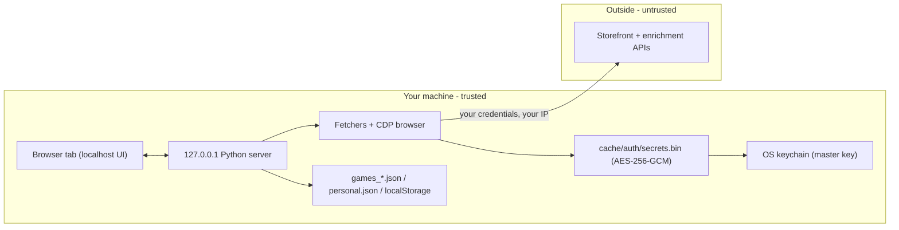

# Security model

BAKLOG is a **local-first** desktop tool. It has no project-owned hosted
backend and **no telemetry by default.** Opt-in anonymous aggregate metrics are
available in Settings (Connections). This document is the threat model: what BAKLOG
defends, what it explicitly does **not**, and the cryptography behind the
claims. For the plain-language data inventory and network-host list, see
[PRIVACY.md](PRIVACY.md).

**Optional invite-only accounts:** When `BAKLOG_SUPABASE_*` is set, Supabase
hosts login only (email + JWT). Your library and Connections secrets still live
under `profiles/<user-id>/` on the machine running `server.py`. Configure
`BAKLOG_SUPABASE_URL` and `BAKLOG_SUPABASE_ANON_KEY` in `.env` (see `.env.example`).

Last updated: 2026-06-03.

## TL;DR

- Your store credentials are generated, used, and stored **only on your
  machine**. There is no central BAKLOG datastore of game libraries or store
  secrets to breach.
- Storefront logins run from **your own browser session and IP**, not from a
  shared cloud — so they look like you, not like a bot farm hitting thousands
  of accounts from a datacenter.
- The credential document is **encrypted at rest** (AES-256-GCM) with a key
  held in your **OS keychain**. An optional master password derives the key
  via scrypt instead.
- The only thing that ever leaves your machine is traffic **you** initiate to
  the storefronts themselves, and any file **you** choose to export.

## Trust boundary

Everything inside the machine boundary is assumed to run as **your** OS user.
BAKLOG's security goal is that nothing crosses the boundary except the
storefront calls you ask for and the files you explicitly export. Optional
Supabase auth adds a small hosted login box (credentials and catalog JSON still
on your machine unless you later opt into Phase 6 cloud mirror work).

## Assets we protect

| Asset | Where it lives | Sensitivity |
|-------|----------------|-------------|
| API keys (Steam, OpenXBL, ITAD, HLTB) | `.env`, encrypted secrets doc | High |
| Session cookies / NPSSO (GOG, PSN, Xbox, Ubisoft, itch, Epic storefront) | `.env`, CDP browser profiles (`cache/auth/profiles/`), encrypted secrets doc | High |
| OAuth refresh tokens (Epic, Battle.net, Nintendo) | `cache/<store>/session.json`, OS keychain, encrypted secrets doc | High |
| Library / wishlist data | `games_*.json`, `itad_prices.json` | Low |
| Personal annotations (status, notes, priority) | `data/personal.json`, `localStorage` | Low–medium |

The design treats **credentials as high-value and catalog data as
low-value**, and keeps them separable — that split is what makes any future
opt-in catalog sync possible without ever moving a credential.

## Cryptography

### Credential document at rest (`cache/auth/secrets.bin`)

- **Cipher:** AES-256-GCM (`cryptography` AEAD), fresh random 12-byte nonce on
  every write, authentication tag verified on read.
- **Key, default:** 32 random bytes from a CSPRNG, stored in the OS keychain
  via `keyring` (Windows Credential Manager / DPAPI, macOS Keychain, Linux
  Secret Service).
- **Key, master-password mode:** derived from your passphrase with
  **scrypt (N=2¹⁴, r=8, p=1, 32-byte key)** over a random 16-byte salt; the
  derived key is never written to disk.
- **Fallback:** if no keyring backend is available, the random key is written
  to `cache/auth/.master_key`. This is weaker (a plaintext key file protected
  only by OS file permissions) — see residual risks.

Source: [auth/secrets.py](auth/secrets.py).

### Portable secrets bundle (export/import)

- Format: magic `BAKLOGSB`, version byte, scrypt parameters, 16-byte salt,
  12-byte nonce, then AES-256-GCM ciphertext.
- **Always** passphrase-encrypted (minimum 8 characters) with
  **scrypt (N=2¹⁴) + AES-256-GCM**, independent of the local keychain/master
  key, so a bundle is safe to carry on a USB stick or email to yourself.
- Losing the bundle passphrase is unrecoverable by design — there is no reset
  path and no escrow.

Source: [auth/bundle.py](auth/bundle.py).

### Containment guarantees

- Credentials are **never** written into `games_*.json`, **never** logged in
  plaintext to stdout, and **never** included in the "Copy bug bundle" payload
  (which is a strict field whitelist — see PRIVACY.md).
- The local server binds to **127.0.0.1**, so it is not reachable from other
  machines on your network by default.

## How BAKLOG reaches each store

Every fetch runs locally, authenticated as **you**, against **your own**
account — never a shared server or pooled credential. What differs per store is
*how* the request is authorized. The posture below, weakest-to-strongest from a
terms-of-service standpoint:

| Store | Method | ToS posture |
|-------|--------|-------------|
| Steam | Official Steam Web API key (yours) | **Sanctioned** — documented public API |
| Xbox | OpenXBL API key (yours) | **Sanctioned** — third-party API you authorize |
| ITAD / HLTB | Official/public API | **Sanctioned** |
| Epic | Official OAuth (community launcher client) + your auth code | **Tolerated** — official OAuth, well-known client id |
| GOG (web), PSN, Ubisoft, Amazon (web) | Replay **your own** web session cookie/token | **Gray** — same calls your browser makes; automated locally |
| itch (API key) | Official itch.io API with **your** key | **Gray** — sanctioned API, your credentials |
| Amazon Games, GOG Galaxy, itch butler | Read **your own** launcher SQLite on disk (read-only, no network) | **Local read** — Amazon launcher DB is DPAPI-encrypted (Windows launcher only); Galaxy and butler are plain SQLite from your install. On macOS/Linux use Prime Gaming web for Amazon. |
| Nintendo, Humble, Epic wishlist, Xbox wishlist | Headless replay of **your own** saved browser profile | **Gray** — your session, your data, your IP |
| Battle.net | Unofficial endpoint with **your own** session | **Gray** |
| EA App | Replays **your own** ea.com web-session Bearer token (sniffed from your saved profile) and calls the same GraphQL endpoint ea.com itself uses | **Gray** — your session, your data; **no** desktop-client impersonation and **no** baked-in EA secret |

Design rule for the gray rows: BAKLOG only ever **replays a session you
established yourself** and only reads **your own** account's data. It does not
ship stolen/first-party client secrets, does not solve CAPTCHAs for you, does
not pool requests across users, and does not redistribute fetched catalogs.

> EA specifically: an earlier draft authenticated by impersonating EA's desktop
> app (a hardcoded client secret + `pc_sign` token). That was replaced with the
> web-session-replay approach above so the "this is just me, automated" framing
> stays literally true. The token BAKLOG uses is the exact one ea.com hands your
> browser when you log in.

This is *automation of your own access*, not third-party scraping. It still runs
**at your own risk** under each store's terms — see the out-of-scope note below.

## What is explicitly out of scope

BAKLOG is not trying to defend against these, and you should not assume it
does:

- **A local attacker or malware running as your OS user.** Anything with your
  user privileges can read the OS keychain and decrypt the secrets doc, exactly
  like any other app you have logged into. Full-disk encryption and a secure OS
  account are your responsibility.
- **Plaintext `.env` and browser profile cookie jars.** Some credentials live in
  `.env` and `cache/auth/profiles/<store>/` as the storefronts' own cookie
  files. These are protected by OS file permissions, not by BAKLOG encryption.
- **The `.master_key` fallback** when no keychain exists — a key file on disk.
  Prefer a real keychain or enable the master password.
- **Browser `localStorage`.** Anything that can read the served origin can read
  your annotations and UI prefs there. It holds no credentials.
- **Shared-family profile switching without a PIN.** Optional per-profile PINs
  (`Manage profiles`) gate switching when `BAKLOG_LOCAL_PROFILES=1` is set
  alongside Supabase auth. Without a PIN, anyone at the keyboard can switch
  profiles while the app is open.
- **Cross-profile secrets if the OS keyring master key is compromised.** Each
  profile's `secrets.bin` uses a derived subkey (HKDF from the shared keyring
  master + profile id). Sibling profiles cannot decrypt each other's blob from
  disk alone, but a full keyring compromise still unlocks all profiles.
- **Storefront terms of service and account flagging.** Automated fetches run
  under your account at your own risk. Replaying only your own session from your
  own IP (see [How BAKLOG reaches each store](#how-baklog-reaches-each-store))
  is a mitigation, not a guarantee — several stores' terms restrict any
  automated access regardless of whose data it is.
- **Supply-chain / dependency compromise.** Standard for any local app; pin and
  review what you install.
- **Exposing the server yourself** (binding to `0.0.0.0`, port-forwarding, or
  sharing the port) moves the trust boundary and is on you.

## Why local-first is the security posture, not just a preference

A hosted version would have to hold every user's live storefront sessions —
sessions tied to payment methods — in one place. That central store is the
single most valuable thing an attacker could target, and it would not exist if
the product were not hosted. By keeping auth and fetching on each user's
machine:

- there is **no honeypot**: a breach of the project compromises no user
  secrets, because the project holds none;
- storefront fraud systems see **a normal user from a residential IP**, not one
  server logging into thousands of accounts;
- the blast radius of any single mistake is **one machine**, not the user base.

## Reporting a security issue

Email the author at the address in [pyproject.toml](pyproject.toml) for issues
that could expose **someone else's** data or credentials. Issues that only
affect your own local files are fine as regular GitHub issues. Please do not
open public issues for anything that could put another user's storefront
accounts at risk.
