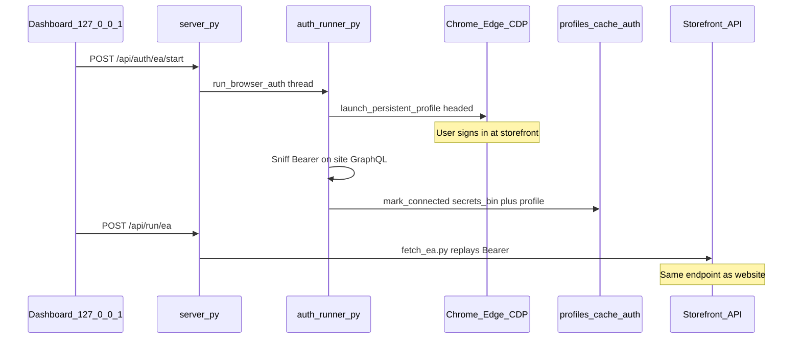
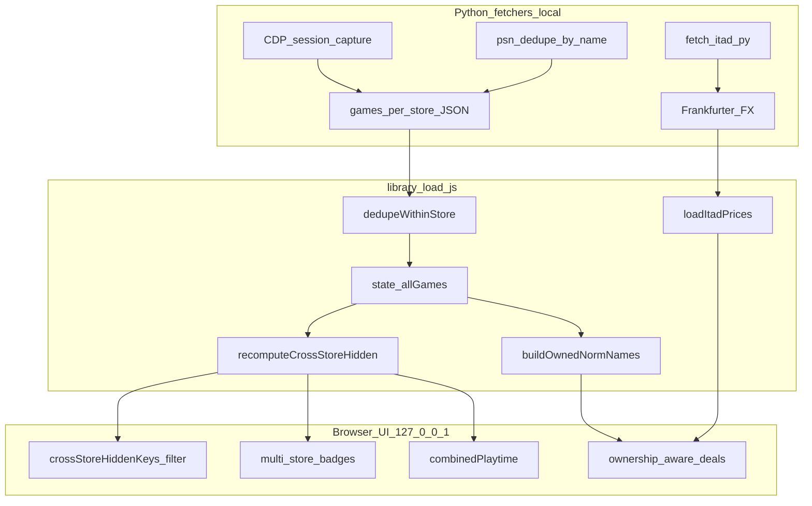

# Defensive Publication: Local-First Multi-Storefront Game Library Aggregation with Session Replay, Cross-Store Reconciliation, and Ownership-Aware Deal Suppression

**Project:** BAKLOG (steam-backlog)  
**Author / Inventor:** Dan Og (Ogrods)  
**Publication date:** 2026-06-04  
**First public disclosure:** 2026-05-27 (initial commit, public GitHub repository)  
**Repository:** https://github.com/Ogrods/steam-backlog  
**License:** MIT (source code); this document is dedicated to the public as prior art.

---

> **Notice.** This document is a defensive publication intended to establish prior art. It is **not legal advice** and does not create enforceable patent rights. The invention described herein has been publicly disclosed via an open-source repository since 2026-05-27. Under U.S. law, a provisional patent application could still be filed within one year of that first public disclosure (approximately before 2027-05-27); most foreign jurisdictions require absolute novelty and likely offer no grace period after public GitHub publication.

---

## Abstract

Disclosed is a computer-implemented method and system for aggregating video-game ownership data from a plurality of digital storefronts entirely on a user's local machine, without a central credential or catalog server operated by the aggregator. The method comprises: (1) capturing store-authentication material through a managed browser session driven by the Chrome DevTools Protocol (CDP), including persistent browser profiles, cookie extraction, OAuth authorization-code exchange, and interception of HTTP authorization headers on the storefront's own API traffic; (2) encrypting captured secrets locally using AES-256-GCM with a master key derived from an operating-system keyring or user master password; (3) replaying the user's own established session against the same web API endpoints the storefront website uses, issuing outbound requests from the user's machine and IP address; (4) reconciling duplicate titles across stores by normalized title string matching, selecting a canonical survivor row by fixed store-priority order, surfacing multi-store ownership badges and combined playtime on the survivor; (5) suppressing or deprioritizing wishlist deal alerts when a normalized title is already present in the user's deduplicated library; and (6) converting wishlist prices at fetch time into a display currency aligned with deal-pricing region data while preserving native storefront price labels. The combination of local-only session replay, encrypted per-profile credential storage, normalized-title cross-store reconciliation, and ownership-aware deal filtering on a unified backlog table constitutes the disclosed contribution.

---

## Field of the Disclosure

This disclosure relates to personal computer software for managing video-game libraries acquired across multiple digital distribution platforms (e.g., Steam, Epic Games Store, GOG, PlayStation Network, Xbox, Amazon Games, Battle.net, Ubisoft Connect, Nintendo eShop, itch.io, Humble Bundle, EA App), and more particularly to local-first methods for credential capture, session replay, cross-store identity reconciliation, and ownership-aware commercial-intent filtering without uploading user credentials or library catalogs to a third-party aggregation server.

---

## Background and Problem Statement

Modern PC gamers accumulate large libraries through years of purchases, free-game promotions, subscription drops, and bundle keys redeemed across many storefronts. Each storefront exposes ownership through its own launcher, website, or API surface. No single storefront provides a truthful cross-store inventory of what the user already owns elsewhere.

Existing approaches fall into several categories, each with limitations relevant to this disclosure:

| Category | Examples | Limitation relative to this disclosure |
|----------|----------|----------------------------------------|
| **Launcher / library managers** | Playnite, GOG Galaxy, MyGamesAnywhere (MGA) | Aggregate installed or linked libraries and metadata; generally do not fuse third-party deal pricing with cross-store ownership context for duplicate-buy prevention on a unified wishlist backlog table. MGA emphasizes canonical merge with source provenance but uses a different architecture (local database + provider resolver) than the session-replay fetcher pipeline described here. |
| **Deal / price trackers** | IsThereAnyDeal (ITAD), GG.deals, CheapShark, Vaulted Games, PriceGhost, Loadout, Veyra | Surface sales and wishlist alerts; may filter owned titles on a single store or via cloud account linking, but do not combine automatic multi-store owned-library ingestion (12+ sources), local-only credential handling, normalized-title deduplication with store-priority survivor selection, and ITAD deal fusion in one no-account local package. |
| **CLI automation tools** | gmfind | Demonstrates inventory-aware deal filtering and browser-based private-profile export locally, but scoped primarily to Steam wallet automation rather than a multi-store backlog decision layer. |
| **Cloud backlog trackers** | Backloggd, GG (mobile) | Require cloud accounts and manual logging; no automatic cross-store owned-library import. |

The problem addressed by BAKLOG is therefore not merely "list games in one table," but **retrieve what the user already owns across many stores on their own machine, normalize it once, reconcile duplicates without a global game-ID graph, and filter commercial intent (deals) against that ownership truth**—while keeping credentials encrypted locally and issuing store API requests only as the authenticated user from the user's IP.

---

## Detailed Description

The following sections describe an exemplary embodiment as implemented in the BAKLOG open-source project. A person having ordinary skill in the art could reproduce the mechanism from this description together with the cited source files in the public repository.

### 1. Managed-Browser Credential Capture (CDP)

**Overview.** User-initiated connection for each storefront begins in a web dashboard served from `127.0.0.1`. The user clicks **Connect**; the local server starts a background worker that launches the user's installed Google Chrome or Microsoft Edge with a **persistent user-data directory** per store under `profiles/<profile_id>/cache/auth/profiles/<provider>/`. The browser is driven over **Chrome DevTools Protocol (CDP)** (`auth/cdp_browser.py`), not a bundled headless scraper with pooled credentials.

**Sign-in flow.**

1. `POST /api/auth/<provider>/start` creates an auth session (`auth/manager.py`).
2. `run_browser_auth()` opens a **headed** browser window; the user completes normal storefront login (`auth/runner.py`).
3. Upon success, credentials are extracted by one or more capture modes (below) and persisted via `mark_connected()`.

**Capture modes (exemplary).**

| Mode | Stores (examples) | Mechanism |
|------|-------------------|-----------|
| **Persistent cookie / profile** | GOG (`gog-al`), PSN (`npsso`), Nintendo, Humble, Epic wishlist, Xbox wishlist | CDP `context.cookies()` and/or reuse of saved Chromium profile on subsequent headless fetches |
| **HTTP header sniffing** | EA App, Ubisoft Connect | CDP `Network.requestWillBeSent` listener captures `Authorization: Bearer …` (EA Juno GraphQL) or `Authorization` + `Ubi-SessionId` on `public-ubiservices.ubi.com` |
| **Response sniffing** | Epic wishlist, Amazon web | `page.on("response")` captures storefront GraphQL or collection API payloads during navigation |
| **OAuth code scrape + exchange** | Epic library | Redirect page yields `authorizationCode`; local client exchanges for refresh token (`EpicClient.login()`) |
| **Official API key extraction** | Steam, itch.io, ITAD, Xbox (OpenXBL) | Headed navigation to developer/API pages; keys scraped from DOM (`auth/api_keys.py`) |
| **Sony ssocookie poll** | PSN | Poll `ca.account.sony.com/api/v1/ssocookie` after sign-in |
| **Manual paste / form** | itch, ITAD, Epic fallback | `PUT /api/auth/<provider>/credentials` |
| **Local launcher database read** | Amazon Games launcher, GOG Galaxy, itch butler.db | Read local SQLite/registry paths without browser (`amazon_client.py`, `gog_galaxy_client.py`, `itch_local_client.py`) |

**Design rule.** BAKLOG replays a session the user established themselves and reads only that user's account data. It does not ship stolen first-party client secrets (except community-documented OAuth patterns where the user supplies their own code/token), does not pool credentials across users, and does not operate a central catalog server.



**Key files:** `auth/runner.py`, `auth/cdp_browser.py`, `auth/manager.py`, `auth/registry.py`, `js/connections.js`, `server.py`.

---

### 2. Encrypted Local Credential Store

Captured secrets (API keys, bearer tokens, NPSSO strings, profile markers) are stored in a per-profile encrypted document:

- **Path:** `profiles/<profile_id>/cache/auth/secrets.bin`
- **Cipher:** AES-256-GCM via `cryptography.hazmat.primitives.ciphers.aead.AESGCM`
- **Nonce:** 12 random bytes prepended to each write; atomic write with `.bak` backup
- **Master key sources (priority order):**
  1. Optional user **master password** → scrypt (`N=2^14`, 32-byte key), salt in `.mpw.salt`
  2. **OS keyring** — service `steam-backlog`, account `secrets-master`
  3. Fallback file `cache/auth/.master_key` (weaker; documented as residual risk)

Provider-specific key-value blobs live inside the encrypted JSON document under `doc["providers"][provider]` (e.g., `PSN_NPSSO`, `EA_BEARER_TOKEN`).

**Browser profiles (cookies not in secrets.bin).** Full Chromium user-data trees remain on disk under `cache/auth/profiles/<provider>/`. These are protected by OS file permissions, not BAKLOG encryption—a documented limitation.

**Portable export.** `auth/bundle.py` supports scrypt + AES-256-GCM export/import of secrets and optional profile trees (magic header `BAKLOGSB`).

**Legacy migration.** Process-level `.env` credentials import once into the default profile's encrypted store and archive as `.env.imported`. Named profiles do not read process `.env` for fetchers.

**Key files:** `auth/secrets.py`, `shared/profile_paths.py`, `SECURITY.md`, `PRIVACY.md`.

---

### 3. Own-Session Replay Against Storefront Web APIs

After connection, Python fetcher subprocesses receive **profile-scoped environment only** (`subprocess_env_for_profile()` in `auth/manager.py`) and issue outbound HTTP requests **from the user's machine** to each storefront. The local application server binds exclusively to **`127.0.0.1`** (`server.py`); there is no BAKLOG-operated remote credential vault.

**Exemplary replay patterns.**

| Store | Replay method | Endpoint / notes |
|-------|---------------|------------------|
| **EA App** | Stored Bearer or headless CDP re-sniff | `https://service-aggregation-layer.juno.ea.com/graphql` — same persisted-query hashes as ea.com web app |
| **GOG** | `gog-al` cookie + browser UA/Referer | `embed.gog.com` library APIs |
| **PSN library** | NPSSO cookie | PSNAWP trophy/entitlement APIs |
| **PSN wishlist** | NPSSO | `m.np.playstation.com/api/graphql/v1/op` persisted query |
| **Ubisoft** | Sniffed `Authorization`, `Ubi-SessionId`, `Ubi-AppId` | `public-ubiservices.ubi.com` |
| **Nintendo** | Headless CDP profile | `ec.nintendo.com` Savanna GraphQL + `idToken` |
| **Humble** | Saved profile | `GET /api/v1/user/order`, `GET /api/v1/order/{gamekey}` |
| **Epic wishlist** | Headless profile only (Cloudflare TLS binding) | `store.epicgames.com/wishlist` GraphQL capture — no raw Python cookie replay |
| **Amazon web** | Headless profile replay | Prime Gaming collection pages |
| **Battle.net** | Cookie header | Unofficial account API |
| **Steam / Xbox / ITAD / itch** | User's official or third-party API keys | Respective public APIs |
| **Epic library** | OAuth refresh + Epic catalog APIs | User-owned refresh token |

**Fetcher catalog (manifest).** Twelve library fetchers and eight wishlist fetchers are registered in `fetchers/manifest.json` (Steam, GOG, PSN, Epic, Amazon, Xbox, Battle.net, Ubisoft, Nintendo, itch.io, Humble, EA App; plus eight wishlist counterparts).

**Enrichment pipeline (non-blocking to core method).** Separate scripts backfill HLTB hours, Steam review percentages onto non-Steam rows, cross-store cover images, and ITAD pricing (`fetch_itad.py` → `itad_prices.json`). Fetchers use `merge_cached_row()` to preserve enrichment fields across re-fetch (`fetchers/_base.py`, `fetchers/_authoritative.py`).

**Key files:** `ea_client.py`, `fetch_ea.py`, `gog_client.py`, `psn_client.py`, `nintendo_client.py`, `ubisoft_client.py`, `amazon_web_client.py`, `fetch_humble.py`, `fetch_epic_wishlist.py`, `fetchers/manifest.json`.

---

### 4. Cross-Store Identity Reconciliation

**Data model.** Each fetcher writes JSON catalogs (`games_<store>.json`, wishlist files). The browser loads and merges them into `state.allGames`. Cross-store deduplication is performed **client-side in JavaScript**; there is no external cross-platform game-ID graph.

**Within-store dedupe (`dedupeWithinStore`).** Two passes before merge:

1. Collapse rows sharing the same `store:id`, keeping highest metadata score (`scoreEntry`).
2. Collapse rows sharing the same `store::normalizeNameForDedup(name)`.

The **blacklist** — entries that are not games (betas, wallpapers, costume DLC patterns, internal entitlement slugs) — is filtered unconditionally via `isJunkEntry()` (mirrored by Python source filters such as `_is_entitlement_slug` in `fetch_epic.py`). This is distinct from the user-editable **hidden list** (real games a user hides and can restore from the Hidden games panel; defaults in `js/hidden-defaults.js`).

**PSN within-store dedupe (fetch time).** `psn_client.py::_dedupe_by_name()` groups by `_dedupe_key(name)` (subtitle split + NFKD normalization distinct from JS), prefers PS5 > PS4 > PS3 > Vita, merges `concept_id`, `np_communication_id`, playtime, and rebuilds `store_url` from merged IDs.

**Cross-store dedupe (`recomputeCrossStoreHidden`).**

1. Bucket all library rows by `normalizeNameForDedup(g.name)`.
2. For buckets with ≥2 rows, sort to pick survivor `list[0]`:
   - Primary: lower `storePriority(store)` index.
   - Tie-break: higher `scoreEntry(g)`.
3. Record `crossStoreOwnedStores` — ordered distinct stores in the group — on the survivor key.
4. If `sessionPrefs.crossStoreDedup` is true (default), add non-survivor keys to `crossStoreHiddenKeys`.
5. Sum `playtime_minutes` across siblings into `crossStorePlaytimeByKey` on the survivor.

**Store priority order (`STORE_PRIORITY`):**

```
steam, psn, gog, epic, amazon, nintendo, itch, xbox, battlenet, ubisoft, humble, ea, other, manual
```

**Title normalization (`normalizeNameForDedup`):**

1. Lowercase string.
2. Remove ™, ®, ©.
3. Replace non-alphanumeric runs with spaces.
4. Remove edition/marketing tokens: `remastered`, `edition`, `complete`, `gold`, `definitive`, `enhanced`, `classic`, `goty`, `of the year`, `game of the year`, `special`, `standard`, `deluxe`, `collection`, `anthology`, `pack`, `the`.
5. Collapse whitespace and trim.

**UI effects.** Survivor rows render **multi-store badges** (`storeBadgeHtml`). Hidden duplicate keys are excluded from table queries, counts, and dashboard aggregates. Wishlist cross-store dedupe mirrors the same algorithm on `state.wishlistGames`.

**Key files:** `js/game-core.js`, `js/library-load.js`, `js/table-query.js`, `psn_client.py`, `tests/game-core.test.js`.

---

### 5. Ownership-Aware Deal Suppression

**ITAD fetch (`fetch_itad.py`).** Default scope: wishlist titles only; optional `--include-library` adds owned library keys. Lookup uses `ItadClient.lookup_title()` with Steam/wishlist appid when available. Best deal per ITAD game id written to `itad_prices.json` keyed as `wishlist:<appid>`, `steam:<id>`, etc.

**Owned-title index (`buildOwnedNormNames`).** After library merge, iterate visible (non-hidden) library rows; add each `normalizeNameForDedup(g.name)` to `state.ownedNormNames`.

**Cross-reference (`isOwnedByTitle`).** Wishlist deal rows match ownership by **normalized title equality**, not by ITAD id or Steam appid.

**Suppression layers.**

| Mechanism | Default | Behavior |
|-----------|---------|----------|
| `prefs.dealHideOwned` | **false** | Wishlist table filter excludes rows where `isOwnedByTitle(g.name)` |
| `dealScore()` owned penalty | always | Subtract large constant (e.g., 1000) when owned — deprioritize dashboard "steals" |
| `ownedElsewhereBadgeHtml` | n/a | Visual "owned" pill on deal surfaces |
| Add-game duplicate warning | n/a | `findDuplicateMatch()` warns on manual add using same normalization |

ITAD pricing does not need to have priced the owned copy; ownership suppression is independent of whether ITAD fetched a price for the library row.

**Key files:** `fetch_itad.py`, `itad_client.py`, `js/deals.js`, `js/game-duplicate.js`.

---

### 6. Display-Currency Normalization

**Rate source.** Frankfurter API (`https://api.frankfurter.app/latest`), cached per profile in `cache/fx_rates.json`, refreshed at most every 24 hours (`shared/fx.py`, `fetch_fx.py`).

**Display currency target.** Derived from `itad_prices.json` country/currency fields (`display_currency_for_profile()` in `shared/wishlist_fx.py`; `displayCurrency()` in `js/currency.js`).

**Wishlist conversion (`apply_fx_to_game`).** At fetch time after ITAD refresh:

- Preserve originals in `price_native` / `currency_native`.
- Write converted numeric amounts to `price_amount` / `price_amount_initial` and formatted `price` in target currency.
- Set `fx_converted: true`.

**Comparable pricing.** `gameComparablePrice()` prefers `price_amount`; refuses to compare rows whose native currency differs from display currency unless FX fields are present—preventing accidental ¥ vs $ sort errors.

**Key files:** `shared/fx.py`, `shared/wishlist_fx.py`, `js/currency.js`, `js/deals.js`.

---

### End-to-End Data Flow



---

## Enumerated Disclosure Statements

The following statements describe embodiments dedicated to the public as prior art. They are written in claim-style form for clarity of scope but **do not constitute a patent application**.

1. A method comprising: receiving, on a user-local computing device, user-initiated commands to connect a plurality of digital game storefront accounts; launching, for each storefront, a managed web browser instance controlled via a remote-debugging protocol with a persistent user-data profile; capturing authentication material from the user's completed sign-in session; encrypting and storing said authentication material locally; and issuing, from the same user-local computing device and using the user's network address, data-retrieval requests to storefront endpoints that the storefront's own website uses, thereby building per-store game ownership catalogs without transmitting user credentials to a third-party aggregation server.

2. The method of statement 1, wherein capturing authentication material comprises intercepting, during the managed browser session, HTTP request headers on network traffic to a storefront GraphQL or REST endpoint and extracting a bearer token therefrom for subsequent replay.

3. The method of statement 1, wherein capturing authentication material comprises persisting a Chromium user-data directory and reusing cookies from said directory during a subsequent headless browser session to retrieve library data bound to a storefront anti-bot or TLS fingerprint policy.

4. The method of statement 1, wherein captured secrets are written to a binary blob encrypted with AES-256-GCM using a random 12-byte nonce per write, and wherein a master encryption key is obtained from an operating-system keyring or from a scrypt-derived key of a user-supplied master password.

5. The method of statement 1, further comprising loading JSON catalogs from a plurality of library fetchers into a browser-side application state, grouping rows by a normalized title key produced by lowercasing, removing trademark symbols, replacing non-alphanumeric characters, and stripping edition-marketing tokens, selecting a survivor row per group by a fixed store-priority ordering, hiding non-survivor rows from primary table views while recording all owned stores on the survivor, and summing playtime minutes across hidden siblings onto the survivor.

6. The method of statement 5, wherein the fixed store-priority ordering prioritizes Steam over PlayStation Network over GOG over Epic Games Store over remaining configured storefronts.

7. The method of statement 5, further comprising building a set of normalized titles representing the user's deduplicated library and, when presenting wishlist deal data obtained from a third-party price aggregation service, suppressing or deprioritizing deals whose wishlist title normalizes to a title in said set, thereby preventing duplicate purchase recommendations across storefronts.

8. The method of statement 7, wherein deal suppression comprises at least one of: excluding wishlist rows from a filtered table view when a user preference is enabled, or subtracting a scoring penalty from dashboard-ranked deal candidates when the title is owned.

9. The method of statement 1, further comprising converting wishlist list prices from native storefront currencies into a display currency determined from deal-pricing region metadata, storing both native and converted numeric price fields on each wishlist record, and using the converted fields for sort and filter operations in the browser UI.

10. A local-only application server bound to a loopback network interface, exposing authenticated endpoints to start managed-browser sign-in, stream sign-in progress events, launch whitelisted fetcher subprocesses scoped to a selected user profile, and serve a dashboard that performs cross-store deduplication and ownership-aware deal filtering entirely in client-side logic without uploading library JSON or credentials to a remote BAKLOG-operated server.

---

## Variations and Alternatives

To prevent narrow design-arounds, the following alternatives are also disclosed as equivalent embodiments:

**Credential capture.**

- Manual paste of API keys or session tokens via a credentials form instead of CDP capture.
- Reading local launcher databases (Amazon Games App, GOG Galaxy library DB, itch.io `butler.db`) without browser sign-in.
- OAuth authorization-code exchange performed locally immediately after scrape (Epic).
- NPSSO validation via Sony ssocookie endpoint polling after PlayStation Store sign-in.
- Stealth init scripts that mask automation fingerprints during headed sign-in.

**Session replay.**

- Headless CDP replay using saved profiles for fetch jobs after headed connect (Epic wishlist, Nintendo, Humble, Amazon web).
- Official public APIs where the user supplies their own API key (Steam Web API, OpenXBL, ITAD API key).
- Token refresh flows stored in profile-local cache files (Epic `session.json`).

**Encryption and profiles.**

- Multiple isolated user profiles on one PC, each with separate `secrets.bin`, auth profiles, cache, and fetcher subprocess environment; profile switch cancels in-flight fetchers.
- Portable encrypted bundle export/import for disaster recovery.
- Legacy `.env` one-time import into default profile only.

**Reconciliation.**

- Session-only toggle to disable hiding duplicate rows while retaining multi-store badge metadata.
- Within-store dedupe by `store:id` and by `store::normalizedTitle` before cross-store merge.
- PSN-specific fetch-time dedupe with platform rank tie-breaking distinct from browser-side normalization.
- Wishlist cross-store dedupe parallel to library dedupe using `wishlistEntryStore()` for priority.

**Deals and pricing.**

- ITAD fetch scoped to wishlist by default; optional inclusion of library keys.
- Dashboard deal ranking with owned penalty without table hide.
- Frankfurter triangulation through EUR base; stale-rate ceiling and mixed-currency guard in sort/filter.
- Fallback to Steam wishlist row discount fields when ITAD record absent.

**Additional storefronts.** The manifest pattern supports adding new providers by registering a `ProviderSpec`, fetcher script, and client module without changing the core architecture.

---

## Known Limitations (Disclosure Completeness)

An enabling prior-art publication should acknowledge constraints of the exemplary embodiment:

1. **Cross-store identity uses normalized title strings**, not a universal platform ID graph — distinct games with similar names after token stripping may over-merge; distinct editions may collapse.
2. **PSN/Python dedupe keys differ from JavaScript keys** — PSN merges at fetch time; JS may still receive one row per store until cross-store pass runs.
3. **`dealHideOwned` is opt-in** (default off) — dashboard may still surface owned wishlist titles with badges and score penalties.
4. **ITAD pricing is wishlist-scoped by default** — library ownership suppression does not require ITAD to have priced the owned title.
5. **Browser profile cookie databases are not encrypted by the application** — only `secrets.bin` key-value material uses AES-GCM; Chromium profiles rely on OS permissions.
6. **Store terms-of-service risk** — session replay automates access the user could perform manually; compliance remains the user's responsibility (`SECURITY.md`).
7. **Deep per-title trophy/achievement API enrichment** (per-achievement rarity, unlock timelines) is documented as **planned work** (`p6_deep_trophy_metadata` in project tracker), not part of the shipped embodiment as of 2026-06-04.

---

## Appendix A: Dated Development Timeline

Chronological record of implementation milestones. Dates derive from `CHANGELOG.md` release sections and dated engineering notes in `tracker.html`. Git history begins **2026-05-27** (first public commit).

| Date | Milestone | Source |
|------|-----------|--------|
| **2026-05-27** | Initial local-first Steam backlog dashboard; on-disk API cache; tabbed picks and priority scoring | CHANGELOG 0.1.0, 0.2.0 |
| **2026-05-27** | First public GitHub commit | git |
| **2026-05-28** | GOG library fetcher; multi-store JSON load; namespaced `steam:` / `gog:` personal keys | CHANGELOG 0.3.0 |
| **2026-05-29** | Epic, Amazon, Xbox, Battle.net, Ubisoft, Nintendo, itch.io fetchers; PSN library + trophy progress | CHANGELOG 0.3.1 |
| **2026-05-29** | **IsThereAnyDeal pricing** (`fetch_itad.py` → `itad_prices.json`) | CHANGELOG 0.3.1 |
| **2026-05-29** | **Wishlist deal radar**: hide already-owned (cross-store), owned-elsewhere penalty, min discount / max price filters | CHANGELOG 0.3.1 |
| **2026-05-29** | GOG wishlist fetcher; cross-store cover backfill enricher | CHANGELOG 0.3.1 |
| **2026-05-29** | Dashboard analytics tab (Chart.js KPIs) | CHANGELOG 0.4.0 |
| **2026-05-29** | ESM refactor; shared fetcher base; pytest suite | CHANGELOG 0.5.0 |
| **2026-05-30** | **`server.py` local dev server** (127.0.0.1): queued fetchers, SSE logs, atomic personal API | CHANGELOG 0.6.0 |
| **2026-05-30** | **Fetcher health row**: per-store chips, freshness, stale-only run toggle | CHANGELOG 0.6.0 |
| **2026-05-30** | Epic wishlist fetcher (storefront cookie GraphQL) | CHANGELOG 0.6.0 |
| **2026-06-01** | `merge_cached_row` + authoritative field sets — refetch preserves Steam reviews / HLTB | tracker: `find_fetcher_review_wipe` |
| **2026-06-01** | Fetcher row-count drift guard (`refuse_drift_result`) | tracker: `bs_data_drift` |
| **2026-06-01** | PSN dedupe URL rebuild after concept_id merge | tracker: `find_psn_url_dedupe_drift` |
| **2026-06-01** | PRIVACY.md — local-only, no telemetry policy | tracker: `bs_privacy` |
| **2026-06-02** | **Managed CDP browser login generalized**; encrypted secrets blob + OS keyring | tracker: `bs_managed_login` |
| **2026-06-02** | **Store integration complete**: 12 library + 8 wishlist fetchers including EA own-session Bearer replay | tracker: `find_store_integration_complete` |
| **2026-06-02** | **Local switchable profiles** (`profiles/<id>/` isolation) | tracker: `bs_multiuser_profiles` |
| **2026-06-02** | Display currency from ITAD country; honest per-store wishlist currency labels | tracker: `bs_i18n`, `bs_pricing_currency` |
| **2026-06-02** | Cross-store dedup preference moved to session-only scope | tracker: `find_dedup_pref_force` |
| **2026-06-02** | Portable secrets bundle export/import | tracker: `bs_secret_recovery` |
| **2026-06-02** | Zero network telemetry; local bug bundle | tracker: `bs_telemetry` |
| **2026-06-03** | **Frankfurter FX at fetch time**; wishlist `price_amount` in ITAD display currency | tracker: `bs_fx_conversion` |
| **2026-06-03** | Profile system hardening; per-profile `/cache/*.json`; switch cancels fetchers | tracker: `bs_phase2_reliability` |
| **2026-06-03** | **Fetcher health honesty** — chips show data age / missing keys, not fake connected state | tracker: `bs_fetcher_health_honest` |
| **2026-06-03** | GOG Galaxy + itch butler.db local scan dual-source union | tracker: `find_local_scan_gog_itch` |
| **2026-06-03** | SECURITY.md last updated | SECURITY.md |
| **2026-06-04** | Launch decision: local-only v1; cloud sync deferred to Phase 6 | tracker: `p4_hosted_demo` |
| **2026-06-04** | **This defensive publication** | this document |

**Planned, not shipped as of publication date:** Deep per-title trophy/achievement enrichment (PSN `title_trophies`, Xbox achievements endpoint) as a batched metered pass — tracker id `p6_deep_trophy_metadata`.

---

## Appendix B: Source-File Index

| Component | Primary files |
|-----------|---------------|
| CDP browser driver | `auth/cdp_browser.py` |
| Headed sign-in + credential extraction | `auth/runner.py` |
| Auth orchestration + profile-scoped env | `auth/manager.py` |
| Provider catalog | `auth/registry.py` |
| AES-256-GCM secrets | `auth/secrets.py` |
| Portable bundle | `auth/bundle.py` |
| Local server (127.0.0.1) | `server.py` |
| Connections UI | `js/connections.js` |
| Fetcher manifest | `fetchers/manifest.json` |
| Merge / authoritative fields | `fetchers/_base.py`, `fetchers/_authoritative.py` |
| EA session replay | `ea_client.py`, `fetch_ea.py`, `ea_session.py` |
| GOG session replay | `gog_client.py`, `fetch_gog.py` |
| PSN client + within-store dedupe | `psn_client.py`, `fetch_psn.py` |
| Nintendo / Humble / Epic wishlist replay | `nintendo_client.py`, `fetch_humble.py`, `fetch_epic_wishlist.py` |
| Ubisoft / Amazon web replay | `ubisoft_client.py`, `amazon_web_client.py` |
| ITAD pricing fetch | `fetch_itad.py`, `itad_client.py` |
| FX conversion | `shared/fx.py`, `shared/wishlist_fx.py`, `fetch_fx.py` |
| Cross-store dedupe + normalization | `js/game-core.js` |
| Library load orchestration | `js/library-load.js` |
| Ownership-aware deals | `js/deals.js` |
| Display currency UI | `js/currency.js` |
| Table / wishlist filters | `js/table-query.js` |
| Profile paths | `shared/profile_paths.py` |
| Trust / privacy documentation | `SECURITY.md`, `PRIVACY.md` |
| Release history | `CHANGELOG.md` |
| Engineering dated notes | `tracker.html` |

---

## Publication Statement

The author hereby dedicates the technical subject matter described in this document to the public domain for purposes of prior art. Implementation source code is available under the MIT License at https://github.com/Ogrods/steam-backlog. Third parties may implement similar systems; this publication is intended to prevent exclusive patent claims over the disclosed local-first session-replay aggregation method combined with normalized-title cross-store reconciliation and ownership-aware deal suppression as applied to multi-storefront game libraries.

**Document version:** 1.0  
**Last updated:** 2026-06-04
