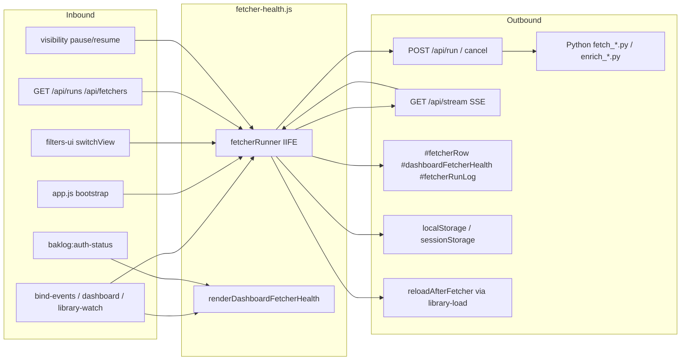
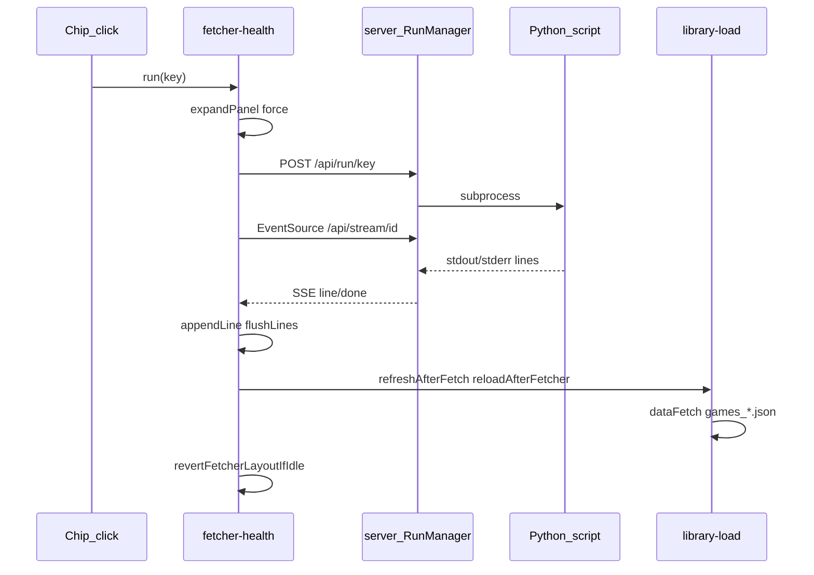

# Fetcher connections matrix

Maps every edge into and out of the fetcher client hub ([`js/fetcher-health.js`](../js/fetcher-health.js)) and its server bridge ([`server.py`](../server.py) `RunManager`). Complements [AUDIT_FINDINGS.md](AUDIT_FINDINGS.md) Section 5 (queue invariants) and Section 6 (per-store health).

**Dashboard UI (collapsible bar):** `#fetcherRow` toggles `is-collapsed` / `is-expanded`. Collapsed: one-line `.fh-bar` (status + log tail). Expanded: `#dashboardFetcherHealth` chips + `#fetcherRunLog` console (2fr / 1fr). Default collapsed via pref `fetcherCollapsed`.

---

## 1. Inbound connections

### 1a. HTTP API (client → server → client)

| Endpoint | Server handler | Client caller | Effect |
|----------|----------------|---------------|--------|
| `GET /api/fetchers` | `_handle_fetchers` | `loadFetcherSources`, `probeApi` | Builds `fetcherSources[]`; sets `apiAvailable` |
| `GET fetchers/manifest.json` | static | `loadFetcherSources` fallback | Registry if API down |
| `GET /api/runs` | `_handle_runs` | `fetchRunsSnapshot` ← `syncFromServer`, cancel, SSE recovery | Reconcile chips, re-`subscribe`, recent-done reload |
| `POST /api/run/<key>` | `_handle_submit` → `MANAGER.submit` | `run`, `runAllStale`, `maybeAutoRefreshItad`, `maybeAutoEnrichNewAdditions` | Queue run, SSE, expand panel |
| `POST /api/run/<id>/cancel` | `_handle_cancel` | `cancelOneRun` | Stop one run |
| `POST /api/runs/cancel` | `_handle_cancel_all` | `cancelInFlightRuns` | Bulk cancel / force reset |
| `GET /api/stream/<id>` | `_handle_stream` | `EventSource` in `subscribe` | `status` / `line` / `done` → log + chips |
| `POST /api/auth/stream-ticket` | stream ticket mint | `urlWithStreamTicket` | SSE auth (account mode) |
| `GET /api/auth/status` | auth status | `syncReconnectFromAuthStatus` | Reconnect chips via `connections.js` |

**Server:** `MANAGER.submit` spawns manifest `script` with profile-scoped `BAKLOG_PROFILE` / `runs_dir`.

**Profile switch:** `POST /api/profiles/active` → `MANAGER.cancel_all_and_wait()` → full reload → boot re-enters fetcher.

### 1b. UI events

| Source | Target | Notes |
|--------|--------|-------|
| `.fh-chip[data-fetcher-key]` | `run(key, { refresh: shiftKey })` | |
| `.fh-run-stale` | `runAllStale()` | |
| `.fh-log-open` | `expandPanel({ manual: true })` | Persists `fetcherCollapsed` |
| `#fetcherRow` bar (not toggle) when collapsed | `expandPanel({ manual: true })` | Click status/tail |
| `[data-role=bar-toggle]` | `toggleFetcherPanel({ manual: true })` | Sole focusable bar control |
| `#showFetcherLog`, `#fetcherGlobalStatus` | `switchView('dashboard')` + `expandPanel` | |
| `[data-fetcher-reconnect]` | `reconnectProvider` — **no run** | Connections only |
| `[data-fetcher-reconnect-dismiss]` | `dismissReconnectRequired` + re-render | |
| Pref toggles (stale-only, auto-enrich, ITAD auto) | re-render / poll behavior | |
| Log cancel / collapse | `cancelInFlightRuns` / `collapsePanel` | |
| `library-watch` `[data-lw-run-steam]` | `run('steam')` | |

`dashboard.js` calls `renderDashboardFetcherHealth()` on dashboard paint (no network).

### 1c. Module imports

| File | Calls |
|------|-------|
| `app.js` | `configureFetcherHealth`, `bootstrapFetcherChrome` |
| `filters-ui.js` | `startDashboardPolling` / `stopDashboardPolling` on view switch |
| `library-load.js` | `maybeAutoEnrichNewAdditions`, ITAD helpers after reload |
| `connections.js` | `baklog:auth-status` → reconnect chip updates |

Chip “Connect” routes to Connections only until user runs a fetcher.

### 1d. Lifecycle and timers

| Trigger | Interval | Functions |
|---------|----------|-----------|
| Dashboard poll | 30s | `syncFromServer`, `maybeAutoRefreshItad` |
| In-flight poll | 10s | `syncFromServer` while runs active |
| Tab hidden | event | stop poll, `closeAllStreams` |
| Tab visible | event | `syncFromServer`, restore poll |
| SSE drop | 2s–30s backoff | `scheduleReconnect` → `subscribe` |
| Programmatic runs | — | ITAD auto, enrich chain, recent-done reload (5 min) |

---

## 2. Outbound connections

### 2a. HTTP / SSE

`baklogFetch`, `fetchWithTimeout`, `EventSource`. Post-run: `refreshAfterFetch` → `reloadAfterFetcher` → `dataFetch` → `applyMergedLibrary`.

### 2b. DOM

| Element | Writer | Purpose |
|---------|--------|---------|
| `#dashboardFetcherHealth` | `renderDashboardFetcherHealth` | Chips, `.fh-bar`, toggles |
| `#fetcherRow` | `applyFetcherRowLayout` | `is-collapsed` / `is-expanded` |
| `#fetcherRunLog` | log chrome, `appendLine` | Console |
| `#fetcherGlobalStatus` | `updateGlobalFetcherIndicator` | Header pill |

### 2c. Storage (profile-scoped keys use `profileScopedStorageKey`)

| Key | Store | Purpose |
|-----|-------|---------|
| `baklog-fetcher-auth-cooldown` | localStorage | Chip backoff |
| `baklog-reconnect-dismissed` | localStorage | Dismiss reconnect |
| `baklog-itad-last-auto-run` | localStorage | ITAD auto throttle |
| `fetcher-suppressed-run-ids` | sessionStorage | Skip SSE after cancel |
| `fetcher-last-seq-by-run` | sessionStorage | SSE `?since=` resume |
| prefs `fetcherCollapsed` | localStorage | Bar expand/collapse |

### 2d. Cross-module

`connections.js` (reconnect banner, auth status), `prefs.js` (`savePrefs`), `library-load` + `dashboard` (reload), `visibility.js` (pause/resume).

`fetcher-registry.js` is used by library-load after runs, **not** imported by fetcher-health.

### 2e. Manifest key → script

| Key | Script | Group |
|-----|--------|-------|
| `steam` | `fetch_games.py` | library |
| `gog` | `fetch_gog.py` | library |
| `psn` | `fetch_psn.py` | library |
| `epic` | `fetch_epic.py` | library |
| `amazon` | `fetch_amazon.py` | library |
| `xbox` | `fetch_xbox.py` | library |
| `battlenet` | `fetch_battlenet.py` | library |
| `ubisoft` | `fetch_ubisoft.py` | library |
| `nintendo` | `fetch_nintendo.py` | library |
| `itch` | `fetch_itch.py` | library |
| `humble` | `fetch_humble.py` | library |
| `ea` | `fetch_ea.py` | library |
| `wishlistSteam` | `fetch_wishlist.py` | wishlist |
| `wishlistGog` | `fetch_gog_wishlist.py` | wishlist |
| `wishlistEpic` | `fetch_epic_wishlist.py` | wishlist |
| `wishlistPsn` | `fetch_psn_wishlist.py` | wishlist |
| `wishlistUbisoft` | `fetch_ubisoft_wishlist.py` | wishlist |
| `wishlistXbox` | `fetch_xbox_wishlist.py` | wishlist |
| `wishlistNintendo` | `fetch_nintendo_wishlist.py` | wishlist |
| `wishlistHumble` | `fetch_humble_wishlist.py` | wishlist |
| `itad` | `fetch_itad.py` | prices |
| `hltb` | `enrich_hltb.py` | enrich |
| `steamReviews` | `enrich_steam_reviews.py` | enrich |
| `steamCovers` | `enrich_cross_store_images.py` | enrich |
| `steamTags` | `enrich_steam_tags.py` | enrich |

Server and client both enforce **max 2 in-flight** (1 active + 1 queued).

---

## 3. End-to-end run flow

---

## 4. Gaps and risks

| Issue | Status | Notes |
|-------|--------|-------|
| `lastBarSummary` scope | fixed | Use `fetcherRunner.setBarSummary()` from `renderDashboardFetcherHealth` |
| Nested `role=button` in `.fh-bar` | fixed | Toggle `<button>` only; `aria-expanded` on toggle |
| Bar focus on re-render | fixed | Restore focus to `[data-role=bar-toggle]` when it had focus |
| Global run queue files | deferred | `p6_multiuser_run_queue` |
| Full `innerHTML` re-render | accepted | Event delegation survives; tail from `lastLineText` |
| Two SSE systems | doc | `/api/stream` vs `/api/auth/<id>/stream` |
| Tab resume reload | intentional | Recent done run within 5 min |

**Easy to miss:** reconnect chips do not POST `/api/run`; collapsed bar still receives log tail updates.

---

## 5. When debugging

1. Chip click → `fetcherRunner.run(key)` in [`bind-events.js`](../js/bind-events.js).
2. `POST /api/run/<key>` → [`server.py`](../server.py) `MANAGER.submit`.
3. `subscribe` → `EventSource` `/api/stream/<runId>`.
4. `done` + exit 0 → `refreshAfterFetch` → `reloadAfterFetcher` in [`library-load.js`](../js/library-load.js).
5. Chips stale/fresh from `state.libraryMeta` via `fetcherFreshness`, not from run queue alone.

**Tests:** `npm run test:js -- tests/fetcher-health.test.js`; `pytest tests/test_fetcher_manifest_audit.py tests/test_run_manager.py -q`.
