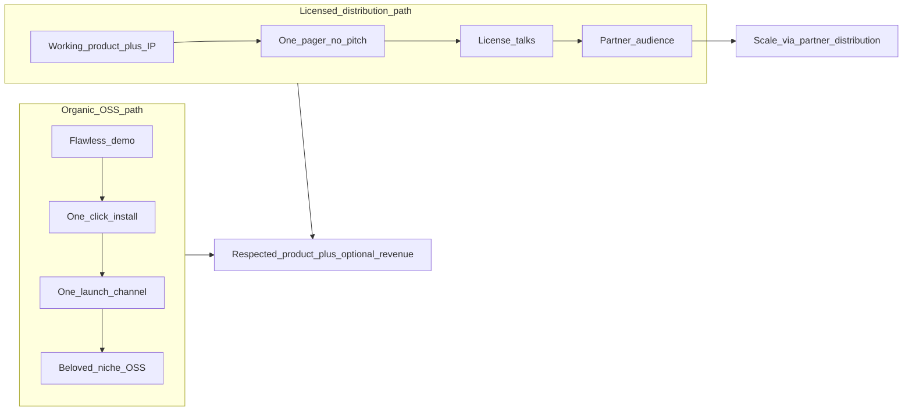

# BAKLOG — Strategy Audit: Gaps to Scale

**Author:** Dan Ogrodnik  
**Date:** 2026-06-04  
**Status:** Working strategic assessment — not a commitment or forecast.

> This document is an honest audit of what is working, what blocks scale, and what to do next. It complements the phase roadmap in `tracker.html`, the operator context in [AUDIT_FINDINGS.md](AUDIT_FINDINGS.md), and the licensing posture in [LEGAL_STRATEGY.md](LEGAL_STRATEGY.md). For how to tell this story in a job search, see [PORTFOLIO_NARRATIVE.md](PORTFOLIO_NARRATIVE.md).

---

## TL;DR

BAKLOG has **exceptional engineering for a solo project** and **sharp, truthful positioning** — but the **live demo is unreliable**, **install friction is high**, and **there is no front door or growth loop**. The architecture (local-first, no server, no telemetry) is a genuine moat *and* a structural ceiling on consumer virality. The realistic path to "huge" is likely **distribution through a partner** (licensing), running **in parallel** with fixing the demo, packaging, and one launch channel — not instead of them.

---

## What is working

### Engineering discipline

Most solo projects never reach this bar:

- **480 automated tests** (pytest + vitest), CI on Windows, axe-core accessibility gate.
- **Production hardening:** atomic writes for `secrets.bin` and `personal.json`, fetcher drift guard (`refuse_drift_result`), CSRF guard on localhost, run-timeout job objects, durable fetcher queue, error boundary with local bug bundle.
- **Honest fetcher health UI** — chips show data age and missing keys, not fake "connected" state.
- **12 library + 8 wishlist fetchers** wired end-to-end with managed CDP browser login, encrypted credential store, and profile isolation.

*Evidence:* `tracker.html` Phase 3 items (mostly `[DONE]`), [AUDIT_FINDINGS.md](AUDIT_FINDINGS.md) Section 1–5 pass tables.

### Positioning and trust

- **"One honest backlog across every store"** and **"there is no BAKLOG server to breach"** are product truth, not marketing spin.
- Documented threat model ([SECURITY.md](../SECURITY.md)), privacy posture ([PRIVACY.md](../PRIVACY.md)), and zero-telemetry policy.
- Ownership-aware deals (ITAD + cross-store library) solve a real pain competitors leave on the table.

### Business and IP thinking

- Monetization model follows **revealed preference** (audience acquired games for $0 → freemium + ads + metered enrichment).
- Defensive publication establishes prior art; MIT open core + brand/commercial license path is coherent.
- Licensing outreach documented with sensible guardrails (no pitch, parallel execution, attorney at contract time only).

---

## Prioritized gaps to scale

Ranked by severity. Each gap includes **why it matters** and **so what** if ignored.

### 1. Broken core demo (existential)

**What:** [AUDIT_FINDINGS.md](AUDIT_FINDINGS.md) Section 6 operator context states plainly: *"Store fetchers are largely broken today (API drift, auth churn)."*

**Why:** The entire wedge is the **magic moment** — connect once, hit Refresh, watch fetcher chips go green and the library counter climb (0 → 1,000+ in ~60 seconds). That demo is onboarding, proof, and marketing in one clip. If a new user connects Steam and gets an error, empty table, or stale data, **nothing else on this list converts**.

**So what:** You cannot launch, cannot demo to a licensing partner, and cannot pass an interview "run it live" test until the **Steam-first path works reliably** — then Epic/GOG as the second beat. Tracker item: `audit_fetchers_repair` (per-store, operator-driven).

**Severity:** Blocker for any scale motion.

---

### 2. Install friction (structural ceiling)

**What:** Today: clone repo, Python, `pip install`, run `server.py`, Windows-centric paths (Amazon launcher, DPAPI). Phase 4 items still open: `p4_packaging` (PyInstaller? Tauri? stay clone-and-run?) and `p4_cross_platform_decision`.

**Why:** Every step between "saw the GIF" and "saw my own library" loses roughly half the funnel. "Huge" consumer products need **one-click install** or a **web entry point** — BAKLOG has neither.

**So what:** Without packaging, you cap at power users and r/selfhosted — a respectable niche, not mass adoption. README install verification (`p3_readme_install`) is still unchecked.

**Severity:** High — limits TAM regardless of product quality.

---

### 3. No front door (distribution gap)

**What:** Open items: `p4_landing_page`, `p4_readme_rewrite`, no shipped demo video (`video_magic_moment`), no launch channel chosen (`p5_pick_channel`), no soft launch (`p5_soft_launch`).

**Why:** Marketing copy, one-pager, and investor deck exist under `marketing/` — but **strangers have nowhere to land**. GitHub README is the only public surface; it is not yet a conversion page.

**So what:** You cannot go big through a door that does not exist. Organic growth requires a shareable URL + 60-second screen recording + one channel executed well — not "post everywhere."

**Severity:** High — blocks all outbound motion.

---

### 4. No growth loop (retention + virality)

**What:** Local-first architecture means:

- No server → **no push notifications** for deal alerts when the app is closed.
- No accounts → **no social graph**, no "follow my backlog."
- No telemetry → **no re-engagement emails** (by design).

**Why:** Personal-utility tools do not spread on their own. ITAD/GG.deals win on **habit** (check deals weekly); BAKLOG has no equivalent hook unless the user manually reopens the dashboard.

**So what:** You need an explicit answer to: *What brings users back weekly? What makes them tell a friend?* Candidates: weekly picks email (requires opt-in contact), deal digest (requires running app or future cloud), "share your library stats" card, Reddit/community presence. None are shipped.

**Severity:** Medium-high — limits organic scale even after launch.

---

### 5. Flying blind (measurement gap)

**What:** Zero network telemetry is a **trust asset** — but `p5_metrics` (pick one north-star) is open. No data on time-to-first-fetch, day-7 return, or funnel drop-off.

**Why:** You cannot optimize what you cannot see. Monetization thesis assumes 50k MAU and 1.5% upgrade — unvalidated.

**So what:** Need a **privacy-preserving, opt-in** measurement path: e.g. anonymous install ping, local-only aggregate export, or beta cohort surveys. Without it, kill criteria in `MONETIZE_METRICS` ("no day-7 return after 3+ channel tests") cannot be evaluated.

**Severity:** Medium — blocks informed iteration.

---

### 6. Maintenance treadmill (solo bandwidth)

**What:** 20 storefront integrations, each subject to API drift, auth changes, and Cloudflare/anti-bot updates. One person maintains fetchers, UI, security, marketing, and licensing outreach.

**Why:** Every hour on `audit_fetchers_repair` is an hour not on landing page, packaging, or GTM.

**So what:** Long-term, consider: (a) tier stores into **demo-critical** (Steam, Epic, GOG) vs **best-effort**; (b) community fetcher ownership; (c) licensing partner absorbing maintenance for their distribution. The current breadth is a **demo asset** and a **maintenance liability** simultaneously.

**Severity:** Medium — chronic drag, not a single blocker.

---

## The architectural reframe

Local-first / privacy-maximal design creates a **structural tradeoff**:

| Strength (moat) | Cost (ceiling) |
|-----------------|----------------|
| Credentials never leave device | No cloud re-engagement |
| No server to breach | No network effects |
| Trust with privacy-conscious users | High install friction |
| Defensible vs cloud trackers | No viral loop |

**Implication:** For *this* architecture, "huge" consumer scale is unlikely through organic OSS alone. The realistic scale paths are:

**Licensing is not a side bet** — for "huge," it may be the primary scale mechanism. Organic motion builds **proof and credibility**; a partner with an existing audience (launcher, deal site, handheld vendor, gaming-adjacent brand) ships BAKLOG to users you cannot reach alone. This aligns with the GTM outreach play in `tracker.html` and [LEGAL_STRATEGY.md](LEGAL_STRATEGY.md) §3 (open core + commercial license).

**Run both in parallel** — never gate independent execution on a deal that may not close.

---

## Recommended sequence

Do these in order; do not skip ahead to launch or licensing outreach without (1) and (2).

| Step | Action | Tracker / doc refs | Outcome |
|------|--------|-------------------|---------|
| **1** | Make **Steam demo flawless** (then Epic, GOG) | `audit_fetchers_repair`, AUDIT_FINDINGS §6 | Wedge works for every first-time user |
| **2** | **Kill install friction** — decide packaging (`p4_packaging`) | PyInstaller / Tauri / installer | Funnel survives past power users |
| **3** | **One front door** — landing + README hero + 60s video + **one** channel | `p4_landing_page`, `p4_readme_rewrite`, `p5_pick_channel` | Strangers can discover and convert |
| **4** | **North-star + opt-in metric** | `p5_metrics`, MONETIZE_METRICS | Can evaluate kill/continue |
| **5** | **Licensing as primary scale path** (parallel) | GTM outreach card, LEGAL_STRATEGY | Partner distribution upside |
| **6** | **Decide growth loop** or accept niche | — | Honest goal: huge vs respected niche + licensing |

---

## Honest outcomes framing

Two legitimate end states — pick consciously:

| Goal | What success looks like | Architecture fit |
|------|-------------------------|------------------|
| **Huge consumer app** | Mass adoption, weekly active use, revenue at scale | Requires solving install + distribution + retention; licensing or major packaging partner likely necessary |
| **Respected niche OSS + licensing upside** | Strong GitHub presence, privacy community love, one or more commercial licenses | **Fits current architecture well**; organic ceiling is acceptable if licensing closes |

Both are valid. The mistake is pursuing "huge" while only investing in engineering depth (Phase 3 complete) without demo reliability, packaging, and distribution.

---

## Cross-references

| Topic | Document |
|-------|----------|
| Phase roadmap | `tracker.html` (Phases 4–6) |
| Fetcher health / audit | [AUDIT_FINDINGS.md](AUDIT_FINDINGS.md) |
| Licensing / IP guardrails | [LEGAL_STRATEGY.md](LEGAL_STRATEGY.md) |
| Job / portfolio framing | [PORTFOLIO_NARRATIVE.md](PORTFOLIO_NARRATIVE.md) |
| Monetization thesis | `tracker.html` → Monetization tab |

**Last updated:** 2026-06-04
