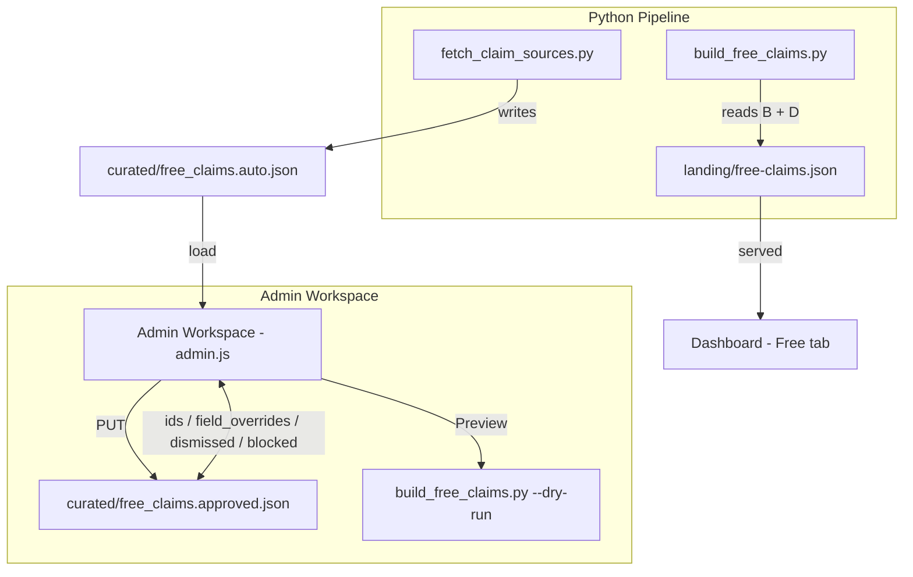

# Admin Claims Pipeline — Senior Dev Audit

## Issues Reported

1. **"Luto free says dupe but the other one is not showing"** — DUPE stamp visible but the duplicate entry is hidden/missing
2. **"There is also one in hidden"** — A claim stuck in the hidden modal
3. **"Can't clear with keep only"** — Keep Only button doesn't work as expected
4. **"Entries I made before are gone"** — Previously approved/title-edited entries have disappeared
5. **No console errors** — Bugs are silent

## Architecture Overview



### Key Data Files

| File                                | Role                                                                                                                   |
| ----------------------------------- | ---------------------------------------------------------------------------------------------------------------------- |
| `curated/free_claims.auto.json`     | Raw claim items from source feeds (GamerPower, ITAD, Epic)                                                             |
| `curated/free_claims.approved.json` | Admin state: `ids`, `field_overrides`, `store_overrides`, `dismissed`, `dismissed_keys`, `blocked`, `premium_only_ids` |
| `free-claims.input.json`            | Optional manual claim entries                                                                                          |
| `landing/free-claims.json`          | Published feed served to dashboard                                                                                     |
| `profiles/<id>/free_claims.json`    | Per-profile copy (populated by fetcher auto-publish)                                                                   |

### Key Functions

| Function                          | File                                                                                                                             | Role                                                     |
| --------------------------------- | -------------------------------------------------------------------------------------------------------------------------------- | -------------------------------------------------------- |
| `norm_title` / `normTitleKey`     | Python: [`free_claims_sources.py`](shared/free_claims_sources.py:90) / JS: [`claims-workspace.js`](admin/claims-workspace.js:29) | Normalize title for dedup matching                       |
| `coverLookupKey`                  | [`claims-workspace.js`](admin/claims-workspace.js:40)                                                                            | Looser title key for admin DUPE stamps (drops stopwords) |
| `claim_match_keys`                | [`free_claims_sources.py`](shared/free_claims_sources.py:104)                                                                    | Stable dedup keys (appid + normalized title)             |
| `merge_key`                       | [`free_claims_sources.py`](shared/free_claims_sources.py:127)                                                                    | Merge key (id first, title fallback)                     |
| `merge_manual_and_auto`           | [`free_claims_sources.py`](shared/free_claims_sources.py:134)                                                                    | Merge manual+auto; manual wins on dup                    |
| `rekey_approved_state`            | [`build_free_claims.py`](fetchers/build_free_claims.py:1348)                                                                     | Migrate approved IDs when auto feed rekeys               |
| `_apply_field_overrides`          | [`build_free_claims.py`](fetchers/build_free_claims.py:868)                                                                      | Apply admin title/store/blurb overrides to auto items    |
| `_carry_forward_missing_approved` | [`build_free_claims.py`](fetchers/build_free_claims.py:1223)                                                                     | Carry approved claims that dropped out of auto feed      |
| `hideDuplicateSiblings`           | [`admin.js`](admin/admin.js:1138)                                                                                                | Keep Only handler                                        |
| `filterAutoItemsForWorkspace`     | [`claims-workspace.js`](admin/claims-workspace.js:356)                                                                           | Filter auto items by dismissed/blocked                   |
| `dupeStampIdSet`                  | [`claims-workspace.js`](admin/claims-workspace.js:310)                                                                           | Compute which items get DUPE badge                       |

## Audit Findings

### Bug 1: "Keep Only" Eventually Hides the Keeper

**Severity**: 🔴 Critical  
**File**: [`admin/admin.js`](admin/admin.js:1138) — `hideDuplicateSiblings`

**Root Cause**: The function adds `dupKey` (the group's `coverLookupKey`) to `dismissedKeys` at line 1147:

```js
// Line 1145-1147
// Dismiss by title key (stable across feed refreshes) so any future item
// with the same normalized title is auto-hidden regardless of source ID.
dismissedKeys.add(dupKey); // BUG: this blocks the keeper on next filter pass
```

This key persists in `free_claims.approved.json` and is applied by [`filterAutoItemsForWorkspace`](admin/claims-workspace.js:374-376) on every subsequent render:

```js
if (dismissedKeys.size) {
  const key = coverLookupKey(item?.title);
  if (key && dismissedKeys.has(key)) return false; // Keeper filtered here
}
```

Since the keeper has the same `coverLookupKey` as the siblings, it gets hidden too — but only after a page refresh or reload since the initial `hideDuplicateSiblings` removes siblings by individual ID (not key).

**Fix**: Remove `dismissedKeys.add(dupKey)` from `hideDuplicateSiblings`. Instead, dismiss each sibling individually by ID (which already happens at line 1154). If future items with the same title need to be auto-hidden, use a separate mechanism that exempts approved items.

### Bug 2: `rekey_approved_state` Permanently Drops Approved Entries

**Severity**: 🔴 Critical  
**File**: [`fetchers/build_free_claims.py`](fetchers/build_free_claims.py:1348) — `rekey_approved_state`

**Root Cause**: When source feed IDs churn and the old ID isn't in `prior_rows_by_id`, the approved entry is silently dropped:

```python
# Line 1395-1405
if not keys and old_id in prior_rows_by_id:
    keys = claim_match_keys(prior_rows_by_id[old_id])
resolved = None
for key in keys:
    resolved = key_to_auto_id.get(key)
    if resolved:
        break
if resolved:
    new_id = resolved
elif auto_items_all and old_id not in prior_rows_by_id:
    continue  # ← DROPS the approved entry permanently
```

Since `rekeyed_ids` is written back to `approved.json` at line 1645, the approved entry is permanently lost from the admin workspace.

**Fix**: Don't drop old IDs when rekeying fails. Keep them in the list — `_carry_forward_missing_approved` (line 1223) already handles carrying them forward from the prior published output:

```python
# Change line 1404-1405 from:
elif auto_items_all and old_id not in prior_rows_by_id:
    continue
# to:
# Keep old IDs even when rekeying fails; carry-forward will handle them.
```

### Bug 3: DUPE Stamp Shown When Duplicate Is Hidden

**Severity**: 🟡 UX Issue  
**File**: [`admin/claims-workspace.js`](admin/claims-workspace.js:310) — `dupeStampIdSet`

**Root Cause**: The function counts both visible AND hidden items when computing DUPE groups (lines 336-337). A visible item gets a DUPE stamp when there are 2+ total items in its group, even if the duplicate is hidden.

This is by design per the comment at line 304-307, but confusing to users.

**Fix**: In the visible pass (line 341), only stamp visible items when there are 2+ visible items in the group. Keep the existing behavior for hidden items. Add a tooltip: "1 hidden duplicate" when visible items have hidden duplicates.

### Bug 4: Title Override Reset on Source ID Churn

**Severity**: 🟡  
**File**: [`fetchers/build_free_claims.py`](fetchers/build_free_claims.py:740) — `_keys_for_approved_id` + [`_apply_field_overrides`](fetchers/build_free_claims.py:868)

**Root Cause**: When the edited title normalizes differently from the source title (e.g., removing "(Stove)" from "Primal Slideee Deluxe (Stove)"), `_keys_for_approved_id` can't find match keys for the new auto items. My partial fix in `_apply_field_overrides` adds an exact-norm fallback, which works when the edit strips giveaway boilerplate (both titles normalize the same) but NOT when the edit removes non-giveaway qualifiers.

**Fix (Complete)**: In `_apply_field_overrides`, add substring containment as a second fallback after exact norm matching fails:

```python
if not overrides and item_title:
    item_norm = norm_title(item_title)
    overrides = override_by_norm.get(item_norm)
    if not overrides:
        # Substring fallback: override norm contained in source norm
        for ov_norm, ov_val in override_by_norm.items():
            if ov_norm in item_norm or item_norm in ov_norm:
                overrides = ov_val
                break
```

### Bug 5: Sync Pairs — Audit Passed

**Status**: ✅ Verified

| Pair                                                                                                                    | Status                                 |
| ----------------------------------------------------------------------------------------------------------------------- | -------------------------------------- |
| `stripClaimTitleDecorations` (admin JS) ↔ `strip_giveaway_decorations` (Python) ↔ `stripClaimTitleDecorations` (app JS) | **IDENTICAL**                          |
| `normTitleKey` (admin JS) ↔ `norm_title` (Python)                                                                       | **IDENTICAL**                          |
| `coverLookupKey` (admin JS) vs `normTitleKey`                                                                           | Intentionally looser (drops stopwords) |

## Fix Plan

| Priority | Bug                      | File                                                                  | Change                                                            |
| -------- | ------------------------ | --------------------------------------------------------------------- | ----------------------------------------------------------------- |
| P0       | Keep Only hides keeper   | [`admin/admin.js`](admin/admin.js:1147)                               | Remove `dismissedKeys.add(dupKey)` — dismiss IDs only             |
| P0       | Approved entries dropped | [`fetchers/build_free_claims.py`](fetchers/build_free_claims.py:1404) | Keep old IDs when rekeying fails                                  |
| P1       | Title override reset     | [`fetchers/build_free_claims.py`](fetchers/build_free_claims.py:895)  | Add substring fallback in `_apply_field_overrides`                |
| P2       | DUPE stamp UX            | [`admin/claims-workspace.js`](admin/claims-workspace.js:341)          | Only stamp visible rows when 2+ visible; tooltip for hidden dupes |
