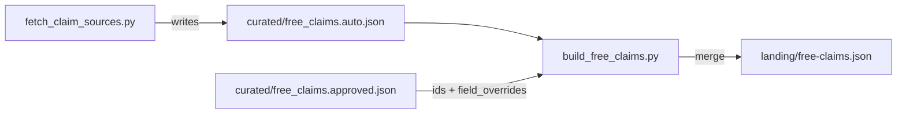

# Claim Title Override Reset — Diagnosis & Fix Plan

## The Bug

Admin workspace edits to claim titles (via `field_overrides` in `curated/free_claims.approved.json`) are lost after running `fetch_claim_sources.py` + `build_free_claims.py`. The published feed reverts to the original source title.

## Root Cause: Rekey Failure on Title Mismatch

### The Pipeline



### How Title Overrides Work

1. User edits a claim title in the admin workspace → stored as `field_overrides["gamerpower-3498"] = { title: "Primal Slideee Deluxe" }`
2. `fetch_claim_sources.py` re-runs → source feed (GamerPower) generates a **new ID** for the same game, e.g. `gamerpower-4000`, with **original source title** "Primal Slideee Deluxe (Stove)"
3. `build_free_claims.py`[`main()`](fetchers/build_free_claims.py:1558) calls `rekey_approved_state`[`rekey_approved_state()`](fetchers/build_free_claims.py:1348) to migrate the old approved ID to the new auto ID

### The Failure

In [`rekey_approved_state()`](fetchers/build_free_claims.py:1348), for each approved ID not found in the new auto feed:

1. Calls [`_keys_for_approved_id()`](fetchers/build_free_claims.py:740) which falls back to `claim_match_keys` of the **field_overrides' edited title** since the old ID isn't in `auto_by_id`

2. Edited title "Primal Slideee Deluxe" → `norm_title` → `"primal slideee deluxe"` → match key `"title:primal slideee deluxe"`

3. New auto item `gamerpower-4000` has source title "Primal Slideee Deluxe (Stove)" → `norm_title` → `"primal slideee deluxe stove"` → match key `"title:primal slideee deluxe stove"`

4. **Keys don't match!** `"primal slideee deluxe"` ≠ `"primal slideee deluxe stove"`

5. `rekey_approved_state` can't find a new ID → the approved entry may be dropped (if not in `prior_rows_by_id`), and `field_overrides` remain keyed by OLD ID `gamerpower-3498`

6. [`_apply_field_overrides()`](fetchers/build_free_claims.py:868) runs on new auto items, but looks up by new auto ID `gamerpower-4000` — which isn't in field_overrides (because rekeying failed) → **title override silently skipped**

7. Published feed uses original source title "Primal Slideee Deluxe (Stove)" — user's edit is gone

### The `_keys_for_approved_id` Flow

```python
# fetchers/build_free_claims.py:740-758
def _keys_for_approved_id(item_id, *, auto_by_id, field_overrides):
    row = auto_by_id.get(item_id)          # old_id not in new auto feed → None
    if row: return claim_match_keys(row)
    fo = field_overrides.get(item_id) or {}  # found: { title: "Primal Slideee Deluxe" }
    title = str(fo.get("title") or "").strip()
    if title:
        norm = norm_title(title)            # "primal slideee deluxe"
        if norm:
            return {f"title:{norm}"}        # ← this key won't match the auto item's
    return set()                            #    key ("primal slideee deluxe stove")
```

## Fix: Consider Both Versions of the Title

### Option A (Recommended): Dual-key fallback in `_keys_for_approved_id`

When field_overrides has a custom title, return BOTH the override-normalized key AND a key based on stripping decorations from the override. This handles the common case where the edit removes a parenthetical qualifier like "(Stove)", "(PC)", etc.

**Better approach**: Also match against the **prior published row's title** (which already has field_overrides applied) and against the **auto items by substring**. The cleanest fix:

In [`_keys_for_approved_id()`](fetchers/build_free_claims.py:740), when falling back to the field_overrides title, also look up the prior published row (if available) and return a union of both match keys:

```python
def _keys_for_approved_id(
    item_id, *,
    auto_by_id,
    field_overrides,
    prior_rows_by_id=None,  # NEW param
):
    row = auto_by_id.get(item_id)
    if row:
        keys = claim_match_keys(row)
        if keys:
            return keys
    # Also check the prior published row for its source title
    if prior_rows_by_id:
        prior = prior_rows_by_id.get(item_id)
        if prior:
            keys = claim_match_keys(prior)
            if keys:
                return keys
    fo = field_overrides.get(item_id) or {}
    title = str(fo.get("title") or "").strip()
    if title:
        norm = norm_title(title)
        if norm:
            return {f"title:{norm}"}
    return set()
```

Wait — this doesn't help because the prior published row ALREADY has the field_overrides title applied from the previous build. So `prior.title` = "Primal Slideee Deluxe" (the edited title), same as the field_overrides.

### Option B (Better): Search auto items by loose title match

In [`rekey_approved_state()`](fetchers/build_free_claims.py:1348), when exact key matching fails, add a fallback that searches auto items by substring or by `strip_giveaway_decorations`:

```python
# After the key-based rekey loop, add a fallback pass:
if not resolved:
    # Loose title fallback: check if any auto item's stripped title
    # contains or is contained by the field_overrides title
    edited_norm = norm_title(edited_title)  # from field_overrides
    for auto_row in auto_items_all:
        auto_norm = claim_match_keys(auto_row)
        if edited_norm in str(auto_norm) or str(auto_norm) in edited_norm:
            resolved = str(auto_row.get("id") or "")
            break
```

### Option C (Simplest): Fix `_apply_field_overrides` to also match by normalized title

In [`_apply_field_overrides()`](fetchers/build_free_claims.py:868), when ID-based override lookup fails, try matching the auto item's normalized title against field_overrides titles:

```python
def _apply_field_overrides(items, field_overrides, field_overrides_by_key=None):
    field_overrides_by_key = field_overrides_by_key or {}
    # Build a reverse lookup: override title norm → override values
    override_by_norm = {}
    for fo_id, fo_val in field_overrides.items():
        title = str(fo_val.get("title") or "").strip()
        if title:
            norm = norm_title(title)
            if norm:
                override_by_norm[norm] = fo_val
    for item in items:
        overrides = _lookup_field_overrides(
            item,
            field_overrides=field_overrides,
            field_overrides_by_key=field_overrides_by_key,
        )
        if not overrides:
            # Fallback: match by item title norm
            item_norm = norm_title(str(item.get("title") or ""))
            overrides = override_by_norm.get(item_norm)
            if overrides:
                item.update(overrides)
```

**Risk**: This would match ANY item with the same normalized title, including ones from different sources. But since `field_overrides` is already scoped to approved IDs, and the override title was edited by the admin, this is an intentional match.

## Files Touched

| File                                                                 | Change                                                              |
| -------------------------------------------------------------------- | ------------------------------------------------------------------- |
| [`fetchers/build_free_claims.py`](fetchers/build_free_claims.py:740) | Option C: Add normalized-title fallback to `_apply_field_overrides` |

## Verification

1. Edit a claim title in admin workspace (e.g., remove parenthetical like "(Stove)" from a title)
2. Run `python fetchers/fetch_claim_sources.py` (generates new auto IDs)
3. Run `python fetchers/build_free_claims.py`
4. Verify the edited title survives in `landing/free-claims.json`
5. Check the dashboard "Free" tab shows the edited title

## Broader Impact

Same issue affects any `field_overrides` field (e.g., `store`, `blurb`, `header_image`) — any field that changes from the source value could cause rekeying to fail. The Option C fix in `_apply_field_overrides` is the safest because it only affects the override application step, not the rekey/dedup logic.
